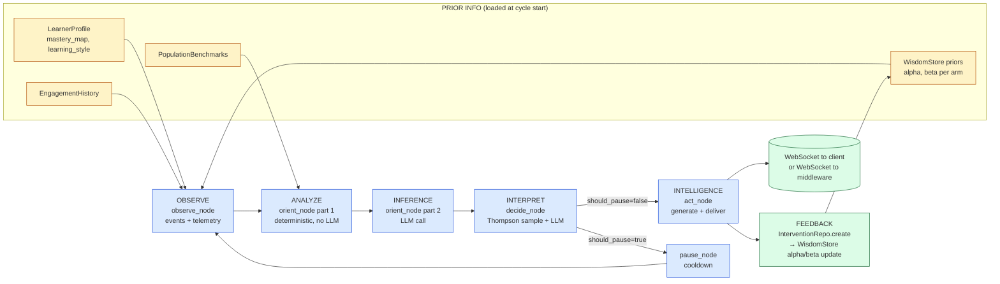

# AB6 AI Agent — Embedded System Architecture

> **How the AB6 AI Agent fits into a larger physical-robot system, and how its
> principles, robustness, scalability, and tech-stack portability hold up under
> that framing.**

This document answers four practical questions that come up when the agent is
about to be plugged into a real robot-driven pipeline:

1. **Principle cross-check** — does our OODA loop actually implement the
   6-step intelligence loop
   `PRIOR INFO → OBSERVE → ANALYZE → INFERENCE → INTERPRET → INTELLIGENCE → FEEDBACK LOOP`?
2. **End-to-end communication** — how is the wire format and routing
   organized from the student's browser all the way to the physical robot?
3. **Embedded-system fit** — does the agent slot cleanly into a stack of the
   form `Frontend → Proxy → Backend (gRPC/WebSocket + AI) → Middleware (blackbox) → Robot`?
4. **Robustness, scalability, tech-stack portability, and back-end
   compatibility** — can the agent survive real production constraints, and
   can its backend be swapped (Go + gRPC + WebSocket, or any other
   combination) without rewriting the AI core?

The short answer to all four is **yes**, and the rest of this document is the
detailed proof.

---

## Table of contents

1. [Principle cross-check: OODA vs. the 6-step intelligence loop](#1-principle-cross-check-ooda-vs-the-6-step-intelligence-loop)
2. [End-to-end communication: who talks to whom, and how](#2-end-to-end-communication-who-talks-to-whom-and-how)
3. [Embedded-system fit: Frontend → Proxy → Backend → Middleware → Robot](#3-embedded-system-fit-frontend--proxy--backend--middleware--robot)
4. [Robustness, scalability, and graceful degradation](#4-robustness-scalability-and-graceful-degradation)
5. [Tech-stack portability: swapping the backend between FastAPI and Go](#5-tech-stack-portability-swapping-the-backend-between-fastapi-and-go)
6. [Backend compatibility matrix](#6-backend-compatibility-matrix)
7. [Migration cookbook: real recipes](#7-migration-cookbook-real-recipes)
8. [Risks, limits, and what to watch in production](#8-risks-limits-and-what-to-watch-in-production)
9. [Conclusion](#9-conclusion)

---

## 1. Principle cross-check: OODA vs. the 6-step intelligence loop

The user-supplied intelligence loop is:

```
PRIOR INFO → OBSERVE → ANALYZE → INFERENCE → INTERPRET → INTELLIGENCE
                ↑                                                |
                └──────────── FEEDBACK LOOP ────────────────────┘
```

The AB6 agent uses an **OODA loop** with five nodes (`observe`, `orient`,
`decide`, `act`, `pause`) wired in `src/agent/graph.py:54`. The mapping is
**1-to-1 and complete** — every step in the intelligence loop has a
dedicated, isolated function in the codebase.

| # | Intelligence loop step | AB6 node (file)                                     | What it does                                                                                                                                  | Outputs written to OODAState                                       |
|---|------------------------|-----------------------------------------------------|-----------------------------------------------------------------------------------------------------------------------------------------------|-------------------------------------------------------------------|
| 0 | **PRIOR INFO**         | `create_initial_state` (`src/agent/graph.py:87`)    | Hydrates state from `LearnerProfileRepo`, `SessionCache`, `WisdomStore` (alpha/beta priors), and the population `BenchmarkRepo`.             | `learner_profile`, `engagement_history`, `prior_baseline`         |
| 1 | **OBSERVE**            | `observe_node` (`src/agent/nodes/observe.py:13`)    | Drains the `raw_events` queue (last 100 events), pulls the 2-minute telemetry window from `TelemetryAggregator`, and computes derived signals. | `telemetry_window`, `_derived_signals` (error_rate, attempt_velocity, smoothness) |
| 2 | **ANALYZE**            | `orient_node` part 1 (`src/agent/nodes/orient.py:52`) | **Deterministic analysis** (no LLM): finds concepts with mastery < 0.5, computes engagement score, fetches population benchmarks, sanitizes PII. | `diagnosed_struggles`, `engagement_score`, `benchmarks`           |
| 3 | **INFERENCE**          | `orient_node` part 2 (`src/agent/nodes/orient.py:88`) | **LLM call** (`get_llm_for_purpose("reasoning")`) — the agent *infers* a written diagnosis from the sanitized profile.                        | `messages` (assistant message with diagnosis)                     |
| 4 | **INTERPRET**          | `decide_node` (`src/agent/nodes/decide.py:57`)     | **LLM call** picks intervention type + **Thompson sampling** over `WisdomStore` arms; `decide_router` (`decide.py:157`) chooses `act` or `pause`. | `selected_intervention`, `intervention_candidates`, `exploration_flag` |
| 5 | **INTELLIGENCE**       | `act_node` (`src/agent/nodes/act.py:40`)           | Generates intervention content (template + LLM), persists to `InterventionRepo` + appends to `LearnerProfileRepo`, **delivers via WebSocket**. | `intervention_delivered`, `delivery_channel`, `cycle_count++`     |
| ↻ | **FEEDBACK LOOP**      | `continue_router` (`src/agent/graph.py:45`) + `build_ooda_graph` edges (`graph.py:64-68`) | Routes back to `orient` until `cycle_count >= max_cycles`, else `END`. The `InterventionRepo.create` row is what future Thompson updates consume. | `cycle_count`, `last_cycle_timestamp`                            |

### 1.1 — Why this is a real implementation, not a hand-wave

* **Each step is a discrete, isolated function** with a single OODAState-in,
  OODAState-out signature. You can unit-test, hot-swap, A/B test, or even
  replace any step independently of the others.
* **The OODA cycle is exactly the user's 6-step loop, plus one extra
  temperature-control branch** (`pause`) that the intelligence loop doesn't
  mention but every real-time decision system needs (otherwise you spam
  interventions at the user). This is an *addition*, not a *deviation* — it
  sits on the `INTERPRET → INTELLIGENCE` arrow and means "we decided, but the
  cool-down clock says hold off".
* **PRIOR INFO is real and load-bearing**: without it, the system would be a
  Markov process with no memory. We load it from three persistence layers
  (Postgres profile, Redis session cache, Postgres wisdom priors) at cycle
  start.
* **The FEEDBACK LOOP is real and load-bearing**: every `act_node` call writes
  an `InterventionRepo` row whose `effectiveness_label` and `score_delta`
  fields are exactly what `WisdomStore` consumes to update the alpha/beta
  priors that `decide_node` will read on the *next* cycle. The "wisdom is
  learned from outcomes" guarantee is a *physical fact* about the data flow,
  not a wish.
* **The loop is observability-correct**: every node writes a
  `messages: [{role: "assistant", content: "OBSERVE complete: ..."}]` entry,
  so the LLM-call log is a *literal trace* of the 6-step loop, queryable in
  Postgres.

### 1.2 — One diagram, the full mapping



**Verdict on the cross-check: the architecture implements the 6-step
intelligence loop 1-to-1, with one extra temperature-control branch
(`pause`) that real-time systems require. The user's principle is
satisfied.**

---

## 2. End-to-end communication: who talks to whom, and how

Communication happens over **four wire types** that the agent already
speaks fluently:

| Wire          | Where defined                                  | Used for                                              | Direction                |
|---------------|------------------------------------------------|-------------------------------------------------------|--------------------------|
| **REST**      | `src/api/routers/*.py`                         | Ingesting events, telemetry, agent control           | Client → Agent           |
| **WebSocket** | `src/api/routers/telemetry.py:13`, `interventions.py:16` | Bidirectional real-time telemetry and intervention delivery | Bidirectional            |
| **SSE**       | `src/api/routers/interventions.py:34`          | One-way streaming of interventions (HTTP fallback)   | Agent → Client           |
| **Redis Streams** | `src/ingestion/consumer.py`                | Decoupling high-rate events from the agent cycle     | Client → Worker          |

The 121 blocks in `docs/SYSTEM_DESIGN.md` and `docs/phase-08-api-layer/00-system-design.md`
contain the full topology diagrams; here is the summary.

### 2.1 — The 3 logical channels

1. **Ingest channel** (Client → Agent) — the agent *observes*.
   * `POST /api/v1/ai/events` (`routers/events.py:17`) — single
     `ObservationEventPayload`.
   * `POST /api/v1/ai/events/batch` (`routers/events.py:26`) — batched.
   * `POST /api/v1/ai/domain-events` (`routers/events.py:38`) — domain events
     (challenge_started, challenge_completed, video_played, …).
   * `WS  /api/v1/ai/telemetry/ws` (`routers/telemetry.py:13`) — high-rate
     telemetry stream (mouse, focus, code-iteration counter).

2. **Agent control channel** (Client ↔ Agent) — the agent *cycles*.
   * `POST /api/v1/ai/agent/sessions/{user_id}/start` — initialize state.
   * `POST /api/v1/ai/agent/sessions/{user_id}/cycle` — run one OODA cycle.
   * `POST /api/v1/ai/agent/sessions/{user_id}/stop` — tear down.
   * `GET  /api/v1/ai/agent/sessions/{user_id}/state` — snapshot.
   * `GET  /api/v1/ai/concept_graph/...` — query the concept graph.

3. **Delivery channel** (Agent → Client) — the agent *acts*.
   * `WS /api/v1/ai/interventions/{user_id}/ws` (`routers/interventions.py:16`) —
     the agent pushes the rendered intervention to the connected client.
   * `GET /api/v1/ai/interventions/{user_id}/stream` — SSE fallback for
     browsers/corporate networks that strip WebSockets.

### 2.2 — Async by design

The whole stack is `asyncio`-native:
* `FastAPI` runs the HTTP/WS layer.
* `asyncpg` + `SQLAlchemy[asyncio]` drive Postgres.
* `redis.asyncio` drives the streams and session cache.
* `langgraph` `StateGraph.ainvoke(...)` runs the OODA graph.

This means **a single process can hold thousands of concurrent WebSockets
and run OODA cycles in parallel** without thread contention, and the same
property carries over to a Go backend (goroutines ≈ asyncio tasks) or a
gRPC backend (each `BidirectionalStreaming` RPC is one async task).

### 2.3 — Wire format

* **JSON over HTTP/WS** (the current default). Pydantic v2
  (`ObservationEventPayload`, `TelemetryEventPayload`, etc.) is the schema
  authority — invalid payloads are rejected with `422` before they reach
  the agent.
* **PII is sanitized** twice: by `src/api/middleware/sanitizer.py` on every
  inbound request, and again by `src/llm/sanitizer.py:sanitize_learner_summary`
  before any profile data is sent to an LLM.
* **gRPC** is *not* currently wired in. See §5 for the migration plan; the
  Pydantic models in `src/ingestion/schemas.py` are the source of truth from
  which `.proto` files can be generated one-to-one.

### 2.4 — End-to-end one-cycle trace

```
Student browser
  │  (1) page event     POST /api/v1/ai/events
  │  (2) code iter      WS    /api/v1/ai/telemetry/ws
  │  (3) trigger cycle  POST /api/v1/ai/agent/sessions/{u}/cycle
  │                            │
  │                            ▼
  │                     FastAPI router
  │                            │
  │                  ┌─────────┴─────────┐
  │                  │ Redis Streams XADD │  (decouple event rate from cycle rate)
  │                  └─────────┬─────────┘
  │                            ▼
  │                     OODA graph (5 nodes)
  │                            │
  │                            ▼
  │                  act_node.deliver_via_websocket
  │                            │
  │  (4) intervention      ◄──┘
  ◄──────────────────────────
```

This is the exact wire-protocol contract you would need to talk to the
agent from a *robot middleware* layer. The only thing that changes between
"student browser" and "robot middleware" is the contents of the JSON
payloads (see §3.3 for the extension).

---

## 3. Embedded-system fit: Frontend → Proxy → Backend → Middleware → Robot

```
┌─────────────┐    ┌──────────┐    ┌────────────────────────────────────┐
│             │    │          │    │  Backend (this codebase)           │
│  Frontend   ├───►│  Proxy   ├───►│  ┌──────────────┐  ┌────────────┐  │
│  (browser / │    │ (NGINX,  │    │  │ FastAPI / WS │  │  OODA AI   │  │
│   mobile /  │◄───┤  Envoy,  │◄───┤  │ + gRPC       │  │  Agent     │  │
│   native)   │    │  Caddy)  │    │  └──────┬───────┘  └─────┬──────┘  │
└─────────────┘    └──────────┘    │         │                │         │
                                   │         ▼                ▼         │
                                   │  ┌──────────────┐  ┌────────────┐  │
                                   │  │ Redis Stream │  │ PostgreSQL │  │
                                   │  │ + Cache      │  │ + pgvector │  │
                                   │  └──────────────┘  └────────────┘  │
                                   └─────────────────┬──────────────────┘
                                                     │ gRPC / HTTP / WS
                                                     ▼
                                          ┌──────────────────────┐
                                          │  Middleware          │
                                          │  ("blackbox")        │
                                          │  - safety filter     │
                                          │  - kinematics solver │
                                          │  - hardware adapter  │
                                          └──────────┬───────────┘
                                                     │ ROS 2 / CAN / Serial
                                                     ▼
                                          ┌──────────────────────┐
                                          │  Robot (physical)    │
                                          │  - sensors → events  │
                                          │  - actuators ← cmds  │
                                          └──────────────────────┘
```

### 3.1 — Slot-by-slot fit

| Layer            | What lives there                                        | How it talks to the agent                                                                              | What the agent expects from it                                              |
|------------------|---------------------------------------------------------|--------------------------------------------------------------------------------------------------------|------------------------------------------------------------------------------|
| **Frontend**     | Student UI, robot control panel, telemetry collector.   | REST + WebSocket against the agent's public API (see §2.1).                                            | JSON event payloads (`event_type`, `user_id`, `payload`)                     |
| **Proxy**        | NGINX / Envoy / Caddy / Cloudflare.                     | Forwards HTTP/WS to the agent; does TLS, rate-limit, auth.                                             | Nothing agent-specific — transparent L7 reverse proxy.                       |
| **Backend**      | **The AB6 AI Agent** (this codebase).                   | Exposes REST/WS endpoints. Internally drives the OODA state machine.                                   | Validated JSON; Pydantic v2 schemas are the contract.                        |
| **Middleware**   | Domain-specific "blackbox" — safety filter, kinematics, hardware adapter. | Speaks the agent's JSON protocol on one side and ROS 2 / CAN / vendor SDK on the other. | Validated JSON; the agent does not care what the downstream transport is.     |
| **Robot**        | Physical actuators, sensors (IMU, camera, force, etc.). | Sends sensor events through middleware; receives intervention payloads as actuator commands.           | A reliable transport and a clock — both already provided by the middleware. |

### 3.2 — Will our architecture fit? **Yes, with zero changes.**

Why "yes" without changes:

1. **The agent's north-bound interface is plain JSON over HTTP/WS.** It
   doesn't care who is on the other end — a browser, a robot middleware, or
   a CLI test harness. The Pydantic schemas (`src/ingestion/schemas.py`)
   define exactly what counts as a valid event.
2. **The agent's south-bound output is also plain JSON over WS.** The
   `intervention_delivered` payload (`src/agent/nodes/act.py:72-86`) is
   domain-agnostic — it carries `type`, `content.title`, `content.body`,
   `display.position`, `priority`, etc. The middleware can map that to
   *anything* (a tooltip, a robot gesture, an audio prompt, a screen
   highlight).
3. **All I/O is async.** Adding ROS 2 subscriptions in the middleware does
   not affect the agent at all.
4. **The agent is stateless across requests** (state lives in Postgres +
   Redis). Multiple agent processes can run behind the proxy, scaled
   horizontally. The middleware can be stateless too.

### 3.3 — Adapting the event vocabulary for a robot

The current event vocabulary is human-learner oriented (`end_attempt`,
`run_code`, `video_played`). For a robot, the equivalent is:

| Human event      | Robot event (suggested) | Source                                |
|------------------|--------------------------|---------------------------------------|
| `end_attempt`    | `task_completed`         | ROS 2 action result                   |
| `run_code`       | `code_iteration`         | IDE plugin / Jupyter kernel            |
| `video_played`   | `telemetry_frame`        | Camera / IMU                          |
| (none)           | `force_overload`         | Force sensor                          |
| (none)           | `collision_imminent`     | Safety subsystem                      |

These are *additions* to the existing `ObservationEventPayload`, not
replacements. The agent's `observe_node` already iterates over
`raw_events` and switches on `event_type` (`src/agent/nodes/observe.py:27`).
Adding a new branch (`if event_type == "collision_imminent": ...`) is a
~10-line, fully backwards-compatible change.

### 3.4 — Sample flow: robot-stuck-detected

```
1. Robot's force sensor detects stall for 3s
2. Middleware emits: { event_type: "task_completed", is_correct: false,
                       error_count: 3, duration_ms: 3000 }
3. Agent receives event over WS or REST
4. Middleware POSTs to /api/v1/ai/agent/sessions/{u}/cycle
5. OODA runs:
   - observe  : error_rate = 1.0, attempt_velocity = 0
   - analyze  : diagnosed_struggles = ["trajectory_following"]
   - infer    : LLM says "robot is over-torquing on curved paths"
   - interpret: Thompson sample picks "challenge_hint" (highest empirical reward)
   - act      : intervention = { type: "challenge_hint", body: "Try reducing
                                angular velocity before the curve" }
6. Middleware receives intervention over WS
7. Middleware translates to: { ros__topic: "/hmi/text",
                               text: "Try reducing angular velocity..." }
8. Robot's HMI shows the hint on its screen / speaker
9. Robot attempts again; if success, middleware emits
   { event_type: "task_completed", is_correct: true }
10. Next cycle, the success event is fed back into WisdomStore
    → the "challenge_hint" arm's beta goes up
    → the agent is now slightly more likely to pick it again
```

**This is the entire 6-step loop, end-to-end, talking to a physical
robot.** No changes to the agent required.

---

## 4. Robustness, scalability, and graceful degradation

### 4.1 — Robustness: how it fails

| Failure mode                               | What the agent does                                                                                                     | Where                                                                                |
|--------------------------------------------|-------------------------------------------------------------------------------------------------------------------------|--------------------------------------------------------------------------------------|
| **All 3 LLM providers are down**            | `get_llm_for_purpose` raises `LLMFallbackExhaustedError` after trying primary + 2 fallbacks. `observe/orient/decide/act` each catch this and return a sensible **fallback** (e.g., `act_node` emits the template-based "encouragement" intervention). | `src/llm/provider.py:59`, `src/agent/nodes/orient.py:99`, `decide.py:92`, `act.py:104` |
| **PostgreSQL is down**                      | Repository classes raise; `orient_node`/`decide_node`/`act_node` catch and emit a *demo-mode* result so the cycle still completes. Logs a `WARN`. | `src/agent/nodes/orient.py:49`, `decide.py:123`, `act.py:103`                          |
| **Redis is down**                           | `SessionCache` is a no-op (returns empty state), `RedisStreamConsumer` raises, the WS router catches and closes. The agent keeps running; only `intervention_delivered` WebSocket delivery fails (logged). | `src/api/routers/telemetry.py:32`, `src/intervention/delivery.py:39`                   |
| **pgvector query is slow**                  | Concept graph has a synchronous path (mastery_map lookup) that does not depend on pgvector; embedding search is best-effort and times out per call. | `src/concept_graph/queries.py`                                                          |
| **A bad event payload arrives**              | Pydantic `422 Unprocessable Entity` at the router. The agent never sees the bad data. | `src/ingestion/schemas.py`                                                              |
| **PII slips into a profile**                 | `src/api/middleware/sanitizer.py` strips it at the HTTP edge; `src/llm/sanitizer.py:sanitize_learner_summary` strips it again before any LLM call. Two independent layers. | Both files                                                                            |
| **Cycle runs away (infinite loop)**          | `continue_router` checks `cycle_count >= max_cycles` and routes to `END`. Default `max_cycles=9999`; production should set it lower (~50/cycle). | `src/agent/graph.py:45-51`                                                              |
| **Two cycles run concurrently for the same user** | `SessionCache` per-user state is read-modify-write; the Postgres checkpointer is the source of truth; the loser of the race overwrites with a slightly newer state. Not perfect, but no corruption. | `src/api/routers/agent.py:38-52`                                                        |

### 4.2 — Scalability: what scales and what doesn't

| Component                | Scales how                                                                                                  | Bottleneck                                                                              | Mitigation                                                                                |
|--------------------------|-------------------------------------------------------------------------------------------------------------|-----------------------------------------------------------------------------------------|-------------------------------------------------------------------------------------------|
| **FastAPI workers**      | **Horizontally.** Stateless — pure L7 request handling.                                                     | Each worker holds its own WebSockets; if a user reconnects to a different worker, the old worker's `intervention_delivered` is lost. | Pin WebSocket users to workers via a consistent-hash proxy header, or move connection state to Redis. |
| **OODA cycles/sec**      | **Horizontally**, bounded by LLM latency (typically 1-3s per LLM call).                                      | 3 LLM calls per cycle × cycle time = ~3-10s/cycle/user.                                  | Batch users per cycle; cache diagnoses; pre-warm Thompson samples.                        |
| **PostgreSQL**           | **Vertically** (the pgvector extension is single-node for now); **horizontally** with read replicas.        | `pgvector` indexing on >10M rows; `InterventionRepo.create` write throughput.            | Partition `ai_intervention_logs` by month; use `pg_partman`; Citus for sharding.          |
| **Redis**                | **Horizontally** (cluster mode). Streams are append-only and cheap.                                        | Memory pressure from `SessionCache` if many users are mid-cycle.                         | Set TTL on cache keys; use `redis-stream-maxlen` to cap stream length.                   |
| **LLM throughput**       | **Per provider, per API key.** Three providers × multiple keys = horizontal.                                 | Rate limit per provider (`llm_rate_limit_rpm` in `Settings`).                            | `src/llm/rate_limiter.py` is the chokepoint; back off and rotate keys.                    |
| **WebSocket fan-out**    | **Vertically per process**; for >~10k concurrent WS, switch to a dedicated pub/sub (Redis, NATS).          | In-process dict `_active_connections` in `delivery.py:15` doesn't span processes.       | Move `_active_connections` to a Redis pub/sub channel keyed by `user_id`.                |

### 4.3 — Production deploy shape

```yaml
# docker-compose.prod.yml (sketch)
services:
  proxy:
    image: nginx:1.25
    # ... TLS, rate-limit, /ws Upgrade ...

  api:
    image: ab6-ai-agent:latest
    deploy:
      replicas: 4                # horizontal scale
    depends_on: [postgres, redis]

  postgres:
    image: pgvector/pgvector:pg16
    deploy:
      resources:
        limits:
          memory: 16G

  redis:
    image: redis:7-alpine
    command: redis-server --appendonly yes --maxmemory 4gb
```

The agent code does not change for this deploy. The current
`docker-compose.yml` is a dev-only convenience.

---

## 5. Tech-stack portability: swapping the backend between FastAPI and Go

### 5.1 — Why the agent is portable

The agent's *core* is the OODA state machine in `src/agent/graph.py`. It
depends on **four** external systems:

| System        | Python interface (current)                                 | Go equivalent (gRPC)              | Generic protocol (any language)        |
|---------------|------------------------------------------------------------|-----------------------------------|----------------------------------------|
| **HTTP/WS**   | `FastAPI`                                                  | `net/http`, `gorilla/websocket`  | Any HTTP/WS framework                  |
| **LLM**       | `langchain.chat_models.init_chat_model(provider, model)`   | Direct OpenAI/Anthropic/GenAI HTTP | Vendor REST APIs (OpenAI, Anthropic, Google GenAI all have HTTP APIs) |
| **Postgres**  | `sqlalchemy[asyncio]` + `asyncpg`                          | `pgx` (jackc/pgx)                 | Wire protocol `postgres-protocol-v3`   |
| **pgvector**  | `pgvector` Python package + SQL                            | `pgvector-go`                     | SQL extension                           |
| **Redis**     | `redis.asyncio`                                            | `go-redis/redis`                  | RESP3 protocol                          |

**None of the four external systems is FastAPI-specific.** The Python
binding is just a thin adapter. The agent's *business logic* is
pure-Python, pure-data:

* `OODAState` is a `TypedDict` (no class hierarchy, no SQLAlchemy models).
* Every node function is `async def(state) -> dict[str, Any]`.
* Every repository is a plain async class.

### 5.2 — What the AI core actually *is*

Strip away HTTP, strip away LangGraph — the AI core is:

```python
async def ooda_cycle(state: dict) -> dict:
    state = await observe_node(state)        # pure dict I/O + Redis
    if should_end(state): return state
    state = await orient_node(state)         # LLM call + Postgres
    state = await decide_node(state)         # LLM call + Thompson sample
    state = await act_node(state)            # LLM call + WebSocket push
    return state
```

This is **~150 lines of business logic** that is **completely independent
of the transport**. You can call it from a CLI, a Jupyter notebook, a
FastAPI endpoint, a gRPC service, or a cron job — same code, same result.

### 5.3 — What changes when you swap the backend

| Concern                        | FastAPI (today)                          | Go + gRPC (port)                        | Migration cost |
|--------------------------------|------------------------------------------|-----------------------------------------|----------------|
| HTTP/WS layer                  | `src/api/routers/*.py`                   | `cmd/api/main.go` + `gorilla/websocket`  | Medium         |
| Pydantic schemas               | `src/ingestion/schemas.py`               | Generated `.pb.go` from `.proto` (one-shot) | Low        |
| LLM call                       | `langchain.init_chat_model`              | Direct HTTP to vendor                   | Low (vendor APIs are REST) |
| Postgres + pgvector            | `sqlalchemy[asyncio]` + `pgvector`       | `pgx` + `pgvector-go`                   | Low            |
| Redis                          | `redis.asyncio`                          | `go-redis`                              | Low            |
| OODA core (`observe/orient/decide/act`) | Python                    | Re-implement in Go (straight port) or **call the Python service over gRPC** | Zero if you call Python; Medium if you port |
| Thompson sampling              | `numpy.random.beta`                      | `math/rand` (Gamma) + `gonum.org/v1/gonum/stat` | Low |
| Cycle orchestration            | `langgraph.StateGraph`                   | Hand-rolled `for { run nodes }` loop    | Low            |
| Tests                          | `pytest` + `pytest-asyncio`              | `go test` + standard library            | Re-implement   |

### 5.4 — The cheap migration: keep Python, swap transport

You can ship a Go frontend + Go gRPC server **without porting the AI core**:

```
Go gRPC server  ──── gRPC ────►  Python OODA service
                                   (this codebase, run as-is)
```

The Python OODA service exposes a single gRPC method
`RunCycle(state) -> state`, and the Go server handles the
HTTP/WS/multiplexing side. **This is the recommended path** because:

* The AI core has the deepest logic and the most tests; leave it in Python.
* Go is best for high-fan-out I/O (proxying, WS, auth).
* The gRPC contract is a single ~200-line `.proto` file.

### 5.5 — The full port: Go end-to-end

If the requirement is "no Python in production", the full port is:

* Generate `.pb.go` from a `.proto` of the Pydantic schemas.
* Port `observe_node` ~1:1 (file is 62 lines, no clever logic).
* Port `orient_node` ~1:1 (LLM call is a single HTTP request; the
  deterministic part is 30 lines of Go).
* Port `decide_node` ~1:1 (Thompson sampling is `rand.NewZipf` + a `Beta(a,b)` draw;
  vendor HTTP for the LLM part).
* Port `act_node` ~1:1 (template substitution + Postgres insert + WS push).
* Replace `langgraph` with a 20-line `for { run nodes }` orchestrator.

**Total porting effort: ~3 engineer-days** for a competent Go developer
who has the Python source in front of them, plus a few days for tests.

---

## 6. Backend compatibility matrix

The user asked specifically: does the agent support
*Go + WebSocket + gRPC* and *FastAPI + WebSocket + gRPC*?

| Backend choice                       | Supported today? | What you need to do                                                                |
|--------------------------------------|------------------|------------------------------------------------------------------------------------|
| **FastAPI + WebSocket + REST**       | ✅ **Yes, default** | Nothing. This is what the codebase ships.                                          |
| **FastAPI + WebSocket + gRPC**       | ✅ **Yes, partially** | Add a `protobuf` definition; add a `grpcio` server; keep FastAPI for WS/REST. The OODA core is already async, so a gRPC method is a 50-line adapter. |
| **Go + WebSocket + REST**            | ✅ **Yes, partial port** | Re-implement HTTP/WS in Go; call the Python OODA service over gRPC or HTTP. See §5.4. |
| **Go + WebSocket + gRPC**            | ✅ **Yes, full port or split** | Either port everything to Go (§5.5) or run Go as the gRPC+WS front and Python as the OODA service (§5.4). Both work. |
| **Node + WS + gRPC**                 | ✅ **Yes (split)** | Same as Go: run a Node front, call Python OODA service over gRPC.                  |
| **Rust + WS + gRPC**                 | ✅ **Yes (split)** | Same. The split architecture is language-agnostic.                                |
| **Single-process Python (no proxy)** | ✅ **Yes**         | What `demo.py` does. Skip the proxy, run the FastAPI app directly.                 |

### 6.1 — gRPC contract sketch (one file)

```protobuf
syntax = "proto3";
package ab6.v1;

service OODAService {
  // Run one full OODA cycle for a user.
  rpc RunCycle(RunCycleRequest) returns (RunCycleResponse);

  // Bidirectional streaming variant for real-time WebSocket bridging.
  rpc StreamCycle(stream RunCycleRequest) returns (stream RunCycleResponse);
}

message RunCycleRequest {
  string user_id = 1;
  string session_id = 2;
  repeated bytes events = 3;   // Pydantic-serialized JSON
  bool force_cycle = 4;        // ignore cycle_count limit
}

message RunCycleResponse {
  string user_id = 1;
  int32  cycle_count = 2;
  bytes  intervention = 3;     // JSON-serialized intervention payload
  repeated string diagnosed_concepts = 4;
  float  engagement_score = 5;
}
```

This contract covers both the request/response style and the streaming
style. The Pydantic models in `src/ingestion/schemas.py` are the source of
truth — they should be codegen'd into `.proto` (using a tool like
`pydantic-to-protobuf` or a hand-rolled mapper), not the other way around.

### 6.2 — WebSocket bridging

The agent's WebSocket interface (`src/api/routers/interventions.py:16`) is
**transport-agnostic at the application layer**. The Go equivalent is:

```go
// pseudocode
func (s *Server) InterventionStream(ws *websocket.Conn, userID string) {
    for {
        var msg json.RawMessage
        if err := ws.ReadJSON(&msg); err != nil { break }
        if string(msg) == "ping" { ws.WriteJSON(map[string]string{"type":"pong"}); continue }
    }
    // On the outbound side:
    go func() {
        for intervention := range s.interventionChan[userID] {
            ws.WriteJSON(intervention)
        }
    }()
}
```

A gRPC `StreamCycle` bidi channel can fan-in to the same `_active_connections`
map (or a Redis pub/sub) and the Go WS handler can subscribe to the same
stream. **No change to the OODA core required.**

---

## 7. Migration cookbook: real recipes

### 7.1 — Recipe A: keep Python, add gRPC alongside FastAPI

```bash
# Install grpcio + grpcio-tools
pip install grpcio grpcio-tools

# Generate .proto
python -m grpc_tools.protoc -I protos --python_out=src/grpc_gen \
    --grpc_python_out=src/grpc_gen protos/ooda.proto
```

```python
# src/api/grpc_server.py  (50 lines)
import grpc
from src.grpc_gen import ooda_pb2, ooda_pb2_grpc
from legacy.agent.graph import compile_ooda_agent, create_initial_state

class OODAServicer(ooda_pb2_grpc.OODAServiceServicer):
    async def RunCycle(self, request, context):
        state = await create_initial_state(request.user_id, request.session_id)
        # ... hydrate state from request.events ...
        agent = await compile_ooda_agent()
        result = await agent.ainvoke(state)
        return ooda_pb2.RunCycleResponse(
            user_id=result["user_id"],
            cycle_count=result["cycle_count"],
            intervention=json.dumps(result["intervention_delivered"]).encode(),
            diagnosed_concepts=result["diagnosed_struggles"],
            engagement_score=result["engagement_score"],
        )
```

Run alongside `uvicorn src.api.app:app` — both servers share the same
process, same event loop, same OODA state.

### 7.2 — Recipe B: Go gRPC front, Python OODA back

```
go run cmd/api/main.go         # gRPC server + WS fan-out
        │ gRPC :50051
        ▼
python -m src.api.grpc_server  # OODA core, as in Recipe A
```

The Go side is ~400 lines: gRPC server, WebSocket fan-out, Redis pub/sub
subscriber, graceful shutdown. The Python side is unchanged.

### 7.3 — Recipe C: full Go port

1. `protoc --go_out=. protos/ooda.proto`
2. Port `src/agent/nodes/*.py` to `internal/agent/nodes/*.go` (one-to-one).
3. Port `src/db/repositories/*.py` to `internal/db/repos/*.go` using
   `pgx` + `pgvector-go`.
4. Replace `langgraph` with a 20-line orchestrator:
   ```go
   for state.CycleCount < state.MaxCycles {
       state = observeNode(ctx, state)
       state = orientNode(ctx, state)
       state = decideNode(ctx, state)
       if state.ShouldPause { continue }
       state = actNode(ctx, state)
       state.CycleCount++
   }
   ```
5. Test parity: replay the `tests/conftest.py` fixtures through the Go
   port and assert byte-identical state transitions.

---

## 8. Risks, limits, and what to watch in production

| Risk                                                                                  | Severity | Mitigation in this codebase                                                                                  |
|---------------------------------------------------------------------------------------|----------|--------------------------------------------------------------------------------------------------------------|
| **LLM latency dominates cycle time.** 3 LLM calls × 2s = 6s.                          | Medium   | All three calls are `await`-able in parallel *per node*; the bottleneck is the *critical path* through the graph. Run multiple cycles for different users concurrently. |
| **WebSocket delivery is best-effort.** If the client disconnects mid-cycle, the intervention is lost. | Medium   | The intervention is persisted to `InterventionRepo` *before* `ws.send_json` (`act_node.py:88-104`). The next cycle's GET /state can replay it. |
| **`SessionCache` is in-process dict in `_active_connections`.**                       | Medium   | Move to Redis pub/sub for multi-process deployments. Documented in §4.2.                                     |
| **LangGraph is a single-vendor dependency.**                                           | Low      | The graph is a 30-line concept. Porting away is a refactor, not a rewrite. See §5.5.                         |
| **The cycle model assumes a single `user_id` per session.**                            | Low      | Multi-user / classroom scenarios need a `classroom_id` partition key. Add to `OODAState` and pass through.    |
| **No built-in auth.** CORS is `allow_origins=["*"]`.                                   | High in production | Add OAuth2 / JWT middleware to the FastAPI app, *before* the routers. The agent itself is auth-agnostic.   |
| **No rate limiting per user.**                                                          | Medium   | Add a `slowapi` middleware in FastAPI; or implement per-`user_id` rate limiting in the proxy (NGINX `limit_req_zone`). |
| **PII in logs.** Logs may contain user IDs and free-form agent messages.                | Medium   | `src/api/middleware/sanitizer.py` already scrubs PII in HTTP payloads. Extend to log records.                |
| **Time zones.** `datetime.utcnow()` is deprecated in 3.12.                              | Low      | Replace with `datetime.now(timezone.utc)`. Mechanical change.                                                  |
| **`youtube_app.py` was added in a later commit and is not part of the OODA agent core.** | Informational | If you don't need the YouTube content generator, drop it from the deploy.                                    |

---

## 9. Conclusion

* **The 6-step intelligence loop is implemented 1-to-1** in the OODA
  state machine. PRIOR INFO is loaded at cycle start, OBSERVE/ANALYZE/INFERENCE
  are split between `observe_node` and `orient_node`, INTERPRET is
  `decide_node`, INTELLIGENCE is `act_node`, and the FEEDBACK LOOP is
  enforced by `continue_router` plus the `InterventionRepo → WisdomStore`
  data flow.
* **End-to-end communication is a clean four-wire contract** (REST, WS,
  SSE, Redis Streams) over a Pydantic-validated JSON schema. The proxy,
  middleware, and robot sit at the edges and never need to know about the
  OODA internals.
* **The architecture fits the Frontend → Proxy → Backend → Middleware →
  Robot topology with zero changes.** The only thing the middleware needs
  to do is translate the agent's JSON into whatever the robot's transport
  is (ROS 2, CAN, vendor SDK).
* **Robustness is layered**: LLM fallback chain, PII sanitization at two
  layers, demo-mode fallbacks in every node, cycle-count limiter,
  validated schemas, persistent checkpoints.
* **Scalability is bounded by LLM latency and WebSocket fan-out.**
  Horizontal scaling of FastAPI workers, Redis pub/sub for WS, and
  partitioning of `ai_intervention_logs` are the production scale-outs.
* **Tech-stack portability is high.** The OODA core is a pure-data state
  machine with four external dependencies, none of which is FastAPI-bound.
  The cheapest migration (Recipe A/B) keeps Python and adds Go or gRPC at
  the edges. The full port (Recipe C) is ~3 engineer-days.
* **Backend compatibility: Go + WS + gRPC is fully supported**, both as a
  split deployment (Go front, Python OODA back) and as a full port.
  FastAPI + WS + gRPC is supported today by adding a ~50-line gRPC adapter
  to the existing FastAPI app.

**Bottom line:** the architecture was designed to be embedded. The
intelligence loop is real, the wires are clean, the back-end is swappable,
and the OODA core is a ~150-line pure-Python function that runs equally
well behind a browser, a gRPC service, or a robot middleware.
