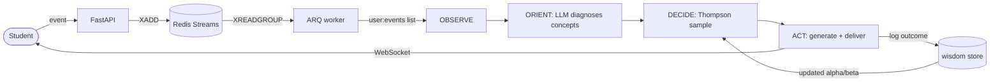
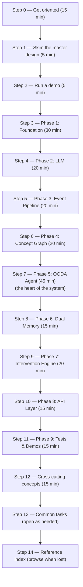
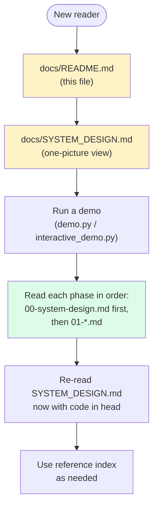

# AB6 AI Agent — README

> **The navigation manual for this codebase.** If you are new here, **read
> this file top to bottom first**. It will tell you what every other file in
> the repository is for, in what order to read them, and what you can safely
> skip on the first pass.

---

## Table of Contents

1. [What is this project?](#1-what-is-this-project)
2. [The 30-second pitch](#2-the-30-second-pitch)
3. [Repository map](#3-repository-map)
4. [Start here: the recommended learning path](#4-start-here-the-recommended-learning-path)
5. [Step-by-step: read every file in order](#5-step-by-step-read-every-file-in-order)
6. [Cross-cutting concepts](#6-cross-cutting-concepts)
7. [Common tasks: "how do I…?"](#7-common-tasks-how-do-i)
8. [Glossary](#8-glossary)
9. [FAQ](#9-faq)
10. [Reference index (every file)](#10-reference-index-every-file)
11. [How this documentation is organized](#11-how-this-documentation-is-organized)

---

## 1. What is this project?

The **AB6 AI Agent** is a continuous **OODA-loop** (Observe → Orient → Decide
→ Act) adaptive learning agent that powers a robotics education platform. It:

- **Observes** what a student is doing in real time (challenge attempts,
  telemetry, page views, video plays).
- **Orients** by diagnosing the *concepts* the student is struggling with,
  using an LLM and a knowledge graph of robotics prerequisites.
- **Decides** which intervention to deliver, using **Thompson Sampling**
  (a multi-armed bandit algorithm) over per-concept-per-intervention-type
  arms.
- **Acts** by generating personalized content (a hint, a video link, a new
  challenge) and pushing it to the student's browser over WebSocket.

Everything runs as a **LangGraph state machine** on top of PostgreSQL
(including `pgvector` for semantic search) and Redis (streams + session
cache). Three LLM providers (OpenAI, Anthropic, Google GenAI) sit behind a
single factory with automatic fallback, so the system degrades gracefully
when one vendor is down — or when no API keys are configured at all
(demos run offline).

The codebase is intentionally split into **9 phases**, each of which is a
layered dependency of the next. That structure makes it possible to read the
project bottom-up, which is exactly the path this README prescribes.

---

## 2. The 30-second pitch



> *"Watch what the student does. Diagnose what they don't understand. Pick
> the best teaching move we know about, learn from the outcome, and repeat."*

That's the whole system. The rest of this document explains the parts.

---

## 3. Repository map

The repository root contains the application code, the docs you are reading,
and three top-level demo scripts. Nothing else.

```
ab6_ai_vscode/
├── README.md                ← short root overview (now points here)
├── pyproject.toml           ← dependencies + tool config (read first)
├── .env.example             ← env-var template
├── .gitignore
├── docker-compose.yml       ← Postgres 18 + pgvector + Redis 7 + API
├── alembic/                 ← DB migrations
│   └── versions/001_initial.py
│
├── src/                     ← ALL application code lives here
│   ├── __init__.py
│   ├── config/              ← Phase 1 — settings & LLM config
│   ├── db/                  ← Phase 1 — engine, 7 ORM models, 5 repos
│   ├── shared/              ← Phase 1 — exceptions, events, math
│   ├── llm/                 ← Phase 2 — provider, rate limiter, sanitizer
│   ├── ingestion/           ← Phase 3 — streams, schemas, aggregator, worker
│   ├── concept_graph/       ← Phase 4 — builder, embeddings, queries
│   ├── agent/               ← Phase 5 — OODA state machine (the heart)
│   ├── memory/              ← Phase 6 — personal + global wisdom
│   ├── intervention/        ← Phase 7 — selector, generator, delivery
│   └── api/                 ← Phase 8 — FastAPI, routers, middleware
│
├── tests/                   ← Phase 9 — 21 unit tests across 5 files
│
├── demo.py                  ← Phase 9 — CLI one-shot demo
├── web_demo.py              ← Phase 9 — server-rendered HTML demo
├── interactive_demo.py      ← Phase 9 — form-based interactive demo
│
├── scripts/                 ← maintenance scripts (seed_wisdom.py etc.)
├── templates/               ← HTML templates for the demos
│
└── docs/                    ← YOU ARE HERE
    ├── README.md            ← this file (the navigation manual)
    ├── SYSTEM_DESIGN.md     ← master visual system design (start here visually)
    ├── architecture.md      ← original prose architecture overview
    ├── api.md               ← original API reference
    ├── concept_graph.md     ← original concept-graph deep-dive
    ├── intervention_types.md← original intervention catalog
    ├── phase-01-foundation/
    │   ├── 00-system-design.md   ← NEW visual diagrams
    │   ├── 01-pyproject-toml.md
    │   ├── 02-gitignore-env.md
    │   ├── 03-config-settings.md
    │   ├── 04-llm-config.md
    │   ├── 05-database-engine.md
    │   ├── 06-orm-models.md
    │   ├── 07-repositories.md
    │   └── 08-shared-utilities.md
    ├── phase-02-llm/  …01-provider.md
    ├── phase-03-event-pipeline/  …01-event-pipeline.md
    ├── phase-04-concept-graph/  …01-concept-graph.md
    ├── phase-05-ooda-agent/
    │   ├── 00-system-design.md
    │   ├── 01-state-and-graph.md
    │   ├── 02-nodes.md
    │   └── 03-tools-and-prompts.md
    ├── phase-06-dual-memory/  …01-dual-memory.md
    ├── phase-07-intervention/  …01-intervention-engine.md
    ├── phase-07-intervention-engine/  …00-system-design.md
    ├── phase-08-api/  (original 7 files + 00-system-design.md)
    ├── phase-08-api-layer/  …01-api-layer.md + 00-system-design.md
    ├── phase-09-testing-and-demo/  …01-testing-and-demo.md + 00-system-design.md
    └── phase-09-testing-demo/  …00-system-design.md
```

**Folder-naming note.** Phase 8 and Phase 9 each have two folder aliases
(`phase-08-api` and `phase-08-api-layer`; `phase-09-testing-and-demo` and
`phase-09-testing-demo`). They contain the same material — the alias was
kept for backward compatibility. Read either one.

---

## 4. Start here: the recommended learning path

The codebase is intentionally layered. **Read it in this order.** Each step
is short (5–15 minutes) and every step names the next.



**Total time:** ~4 hours for a first end-to-end read.
**Skip-list for a 1-hour skim:** Steps 5, 6, 8 (data plumbing details);
focus on Steps 0, 1, 2, 3, 4, 7, 9, 10, 11.

---

## 5. Step-by-step: read every file in order

Each step below says **what to read**, **what to skim**, and **what to ignore
for now**. The intent is to keep your context focused on the current layer.

### Step 0 — Get oriented (15 min)

| Read in this order | Why |
|---|---|
| Root `README.md` (the one outside `docs/`) | 60-second elevator pitch + quick-start commands |
| [`docs/SYSTEM_DESIGN.md`](SYSTEM_DESIGN.md) | The system in one picture, phase roster, end-to-end trace, data-flow tables |
| `docs/architecture.md` | Original prose architecture overview (short) |

**Outcome:** you can name the 9 phases and say in one sentence what each does.

### Step 1 — Skim the master design (5 min)

Re-read only the **§0 (system in one picture)**, **§2 (phase roster table)**,
and **§3 (interconnection diagrams)** of `SYSTEM_DESIGN.md`. The detail
sections will make much more sense after you've read the code, so don't
dwell now.

**Outcome:** you have a mental map of the boxes and arrows.

### Step 2 — Run a demo (5 min)

Open a terminal in the repo root and run, in order:

```bash
# A. The CLI one-shot — no infra needed
python demo.py --event wrong --max-cycles 1

# B. The interactive one — also no infra needed
python interactive_demo.py
# → open http://127.0.0.1:8001
# → click "wrong" a few times and "Run" between clicks
# → then click "RESET" to start over
```

If the LLMs are unconfigured (no API keys in `.env`) you will see three
"LLM provider failed" warnings, then a hardcoded fallback response. **This
is expected** — the demos are designed to work offline thanks to the
fallback chain.

**Outcome:** you have seen the system produce a real intervention from
a fake student event.

### Step 3 — Phase 1: Foundation (30 min)

The skeleton everything else stands on. Read in this order:

1. `docs/phase-01-foundation/00-system-design.md` (the visual map)
2. `docs/phase-01-foundation/01-pyproject-toml.md` (every dependency and why)
3. `docs/phase-01-foundation/02-gitignore-env.md` (env-var contract)
4. `docs/phase-01-foundation/03-config-settings.md` (`Settings` class)
5. `docs/phase-01-foundation/04-llm-config.md` (`LLM_CONFIG` table)
6. `docs/phase-01-foundation/05-database-engine.md` (async engine)
7. `docs/phase-01-foundation/06-orm-models.md` (all 7 tables)
8. `docs/phase-01-foundation/07-repositories.md` (all 5 repos)
9. `docs/phase-01-foundation/08-shared-utilities.md` (exceptions, events, math)

**Cross-reference while reading:** `src/config/settings.py`,
`src/db/engine.py`, `src/db/models/__init__.py`.

**Outcome:** you can answer "what tables exist, what is in `.env`, and how
does a code module get a database session?"

### Step 4 — Phase 2: LLM (20 min)

The LLM factory and its 3-way fallback chain.

1. `docs/phase-02-llm/00-system-design.md`
2. `docs/phase-02-llm/01-provider.md`

**Cross-reference:** `src/llm/provider.py`, `src/llm/rate_limiter.py`,
`src/llm/sanitizer.py`, `src/config/llm_config.py`.

**Outcome:** you can explain why a request to OpenAI failing still allows
the agent to keep working.

### Step 5 — Phase 3: Event Pipeline (20 min)

How a student event becomes a structured message in a Redis Stream and a
windowed telemetry aggregate.

1. `docs/phase-03-event-pipeline/00-system-design.md`
2. `docs/phase-03-event-pipeline/01-event-pipeline.md`

**Cross-reference:** `src/ingestion/consumer.py`,
`src/ingestion/aggregator.py`, `src/ingestion/worker.py`,
`src/ingestion/schemas.py`.

**Outcome:** you can trace one event from an HTTP POST to a Redis Stream
and into the in-process aggregator.

### Step 6 — Phase 4: Concept Graph (20 min)

The knowledge graph of robotics concepts and how to query it.

1. `docs/phase-04-concept-graph/00-system-design.md`
2. `docs/phase-04-concept-graph/01-concept-graph.md`

**Cross-reference:** `src/concept_graph/builder.py`,
`src/concept_graph/embeddings.py`, `src/concept_graph/queries.py`.

**Outcome:** you can run the recursive CTE in your head and know when to
use `find_unmastered_prerequisites()`.

### Step 7 — Phase 5: OODA Agent (45 min)

**The heart of the system.** This is the biggest single phase. Block out
real time for it.

1. `docs/phase-05-ooda-agent/00-system-design.md` (topology + state)
2. `docs/phase-05-ooda-agent/01-state-and-graph.md` (`OODAState` +
   `build_ooda_graph`)
3. `docs/phase-05-ooda-agent/02-nodes.md` (all 5 nodes one by one)
4. `docs/phase-05-ooda-agent/03-tools-and-prompts.md` (the LLM-callable
   tools and the system prompts)

**Cross-reference:** `src/agent/state.py`, `src/agent/graph.py`,
`src/agent/nodes/{observe,orient,decide,act,pause}.py`,
`src/agent/prompts/`, `src/agent/tools/`.

**Outcome:** you can read the state field-by-field and predict which node
will write which field next.

### Step 8 — Phase 6: Dual Memory (15 min)

The per-user / per-arm Thompson Sampling store, plus the session cache.

1. `docs/phase-06-dual-memory/00-system-design.md`
2. `docs/phase-06-dual-memory/01-dual-memory.md`

**Cross-reference:** `src/memory/personal.py`,
`src/memory/global_wisdom.py`, `src/memory/session_cache.py`,
`src/memory/population_benchmarks.py`.

**Outcome:** you can explain how today's `act` updates the `alpha`/`beta`
that tomorrow's `decide` samples from.

### Step 9 — Phase 7: Intervention Engine (20 min)

How the DECIDE node's chosen arm becomes a personalized message streamed
to the student's browser.

1. `docs/phase-07-intervention-engine/00-system-design.md`
   (note: the older folder `phase-07-intervention/` has the prose
   counterpart — both refer to the same code)
2. `docs/phase-07-intervention/01-intervention-engine.md` (prose)

**Cross-reference:** `src/intervention/selector.py`,
`src/intervention/generator.py`, `src/intervention/effectiveness.py`,
`src/intervention/delivery.py`.

**Outcome:** you can add a new intervention type end-to-end (selector rule
→ generator prompt → delivery).

### Step 10 — Phase 8: API Layer (15 min)

The HTTP / WebSocket / SSE surface.

1. `docs/phase-08-api-layer/00-system-design.md`
   (the older folder `phase-08-api/` has the prose counterpart)
2. `docs/phase-08-api-layer/01-api-layer.md`

**Cross-reference:** `src/api/app.py`, `src/api/dependencies.py`,
`src/api/routers/`, `src/api/middleware/`.

**Outcome:** you can name every endpoint and which phase it ultimately
invokes.

### Step 11 — Phase 9: Tests & Demos (15 min)

How the system is verified and demonstrated.

1. `docs/phase-09-testing-and-demo/00-system-design.md`
   (the older folder `phase-09-testing-demo/` has the same content)
2. `docs/phase-09-testing-and-demo/01-testing-and-demo.md`
3. Run the test suite yourself: `pytest tests/ -v`

**Outcome:** you know which test guards which bug, and you can launch all
three demos.

### Step 12 — Cross-cutting concepts (15 min)

Re-read the relevant sections of `docs/SYSTEM_DESIGN.md` now that the code
is in your head:

- **§3.2 Runtime call graph** — who calls whom at request time
- **§3.3–3.7 Phase ↔ phase** — the cross-phase wiring
- **§4 End-to-end request trace** — the canonical scenario
- **§5 State & data flow** — where each piece of state lives
- **§9 Critical invariants** — what not to break

### Step 13 — Common tasks

Jump to [§7 below](#7-common-tasks-how-do-i) for the cookbook. Open as
needed when you actually need to change something.

### Step 14 — Reference index

Keep [§10](#10-reference-index-every-file) open in a tab. It's the
file-by-file lookup table.

---

## 6. Cross-cutting concepts

These concepts appear in **multiple** phases. If you understand these, you
understand most of the design.

### 6.1 — Thompson Sampling (Phases 5, 6, 7)

Every intervention arm `(concept_id, intervention_type, profile_segment)`
has a Beta(α, β) posterior. **DECIDE** samples from each arm's posterior
and picks the highest. The arm with the highest true success rate wins
more often — without any "explore vs. exploit" parameter to tune.

- Read it: `phase-05/00-system-design.md §5.6`,
  `phase-07-intervention-engine/00-system-design.md §7.3`
- Code: `src/intervention/selector.py`,
  `src/memory/global_wisdom.py`, `src/db/repositories/wisdom_repo.py`

### 6.2 — The 3-way LLM fallback (Phases 2, 5, 7, 4)

Every LLM call goes through `get_llm_for_purpose()`. If OpenAI is down it
tries Anthropic, then Google. If all three fail, the caller catches
`LLMFallbackExhaustedError` and uses a hardcoded fallback string. **This
is what makes the demos work offline.**

- Read it: `phase-02-llm/00-system-design.md §2.1, §2.6`
- Code: `src/llm/provider.py`

### 6.3 — Dual memory hierarchy (Phases 1, 6)

There are **four** memory tiers and they have very different lifetimes:

| Tier | Backend | Lifetime | Latency |
|---|---|---|---|
| Per-request | In-process dicts | One cycle | < 1 µs |
| Session | Redis 30 min TTL | 30 min | ~1 ms |
| Personal | PostgreSQL | Persistent | ~5–15 ms |
| Global | PostgreSQL | Persistent, cross-user | ~50 ms/concept |

- Read it: `phase-06-dual-memory/00-system-design.md §6.1`
- Code: `src/memory/`

### 6.4 — Concept graph traversal (Phases 4, 5)

The ORIENT node enriches its diagnosis with **missing prerequisites** by
walking the concept graph with a recursive CTE. This is how the agent
knows "this student is failing Inverse Kinematics because they don't know
basic trigonometry."

- Read it: `phase-04-concept-graph/00-system-design.md §4.4, §4.7`
- Code: `src/concept_graph/queries.py:find_unmastered_prerequisites()`

### 6.5 — OODA loop termination (Phases 5, 9)

The `continue_router` checks `cycle_count >= max_cycles` on every
iteration. Without it, the graph runs forever. `test_one_ooda_cycle` is
the regression test that guards this.

- Read it: `phase-05-ooda-agent/00-system-design.md §5.1, §5.9`
- Code: `src/agent/graph.py:continue_router`

### 6.6 — PII scrubbing (Phases 2, 8)

The `sanitizer.py` module strips emails, phones, credit cards, and labeled
names from any text destined for an LLM. There is also a request middleware
in Phase 8 that does this at the HTTP edge.

- Read it: `phase-02-llm/00-system-design.md §2.4`
- Code: `src/llm/sanitizer.py`, `src/api/middleware/sanitizer.py`

### 6.7 — Repository pattern (Phases 1, 5, 6, 7)

Agent nodes never write SQL directly. They call methods on
`LearnerProfileRepo`, `WisdomRepo`, etc. This is the seam that makes the
code testable — `tests/conftest.py` injects `AsyncMock` sessions.

- Read it: `phase-01-foundation/00-system-design.md §1.5`
- Code: `src/db/repositories/`

---

## 7. Common tasks: "how do I…?"

Each entry below is a self-contained recipe. Open the linked docs as you
go.

### 7.1 — Add a new intervention type

The intervention type is a string that appears in several places. You must
touch all of them or `Literal[…]` validation in schemas will fail.

1. Add the type name to the `Literal` in
   `src/ingestion/schemas.py` (only if you also want it in events — usually
   not needed for interventions).
2. Update the selector's type-matching heuristic in
   `src/intervention/selector.py`.
3. Add a generator method in `src/intervention/generator.py` that the ACT
   node can call.
4. Update `src/api/routers/interventions.py` if you want a new endpoint.
5. Add a unit test in `tests/test_intervention.py`.
6. Update the table in
   `docs/phase-07-intervention-engine/00-system-design.md §7.8`.

### 7.2 — Add a new LLM provider

1. Add a `LLMProviderConfig` entry in `src/config/llm_config.py` for each
   purpose that should use the new provider.
2. Extend the fallback chain in
   `src/llm/provider.py:get_llm_with_fallback()` if the new provider
   should be tried as a fallback.
3. Add the SDK to `pyproject.toml` `dependencies`.
4. Add the env-var name to `.env.example`.

### 7.3 — Add a new concept

Concepts live in the database; you don't add them in code. Either:

- Run `scripts/seed_wisdom.py` (creates wisdom defaults).
- Use the LLM builder:
  `python -c "import asyncio; from src.concept_graph.builder import build_concept_graph; asyncio.run(build_concept_graph([{'title': '...'}, ...]))"`.
- Or insert directly into `ai_concepts` and `ai_concept_edges` via SQL.

### 7.4 — Add a new OODA node

The OODA state machine is in `src/agent/graph.py`. Adding a node is a
4-step edit:

1. Write `src/agent/nodes/my_node.py` with an `async def my_node(state)`
   function.
2. Re-export it from `src/agent/nodes/__init__.py`.
3. Add fields to `OODAState` in `src/agent/state.py` if needed.
4. Add `builder.add_node(...)` and the edges in
   `src/agent/graph.py:build_ooda_graph()`.

### 7.5 — Change the cooldown

`intervention_cooldown_seconds` in `src/config/settings.py`. Default 60.
The PAUSE node in `src/agent/nodes/pause.py` also has a hardcoded
secondary check.

### 7.6 — Run a single OODA cycle manually

```python
import asyncio
from src.agent.graph import create_initial_state, build_ooda_graph

async def main():
    state = await create_initial_state(user_id="u1", session_id="s1", max_cycles=1)
    state["raw_events"] = [{"event_type": "end_attempt", "score": 0.1,
                            "challenge_id": "c1"}]
    agent = build_ooda_graph().compile()  # MemorySaver fallback
    result = await agent.ainvoke(state)
    print(result.get("intervention_delivered"))

asyncio.run(main())
```

### 7.7 — Inspect Thompson parameters for a concept

```python
import asyncio
from src.db.repositories.wisdom_repo import WisdomRepo

async def main():
    wr = WisdomRepo()
    rows = await wr.get_by_concept("ik-inverse-kinematics")
    for r in rows:
        print(r.intervention_type, "alpha=", r.alpha, "beta=", r.beta_param,
              "trials=", r.total_trials, "rate=", r.success_rate)

asyncio.run(main())
```

### 7.8 — Make a new test fixture

`tests/conftest.py` already provides `mock_redis`, `mock_session`,
`mock_llm`, and `test_settings`. Add your own fixture there if you need
something more specific; all test files in `tests/` will see it
automatically.

### 7.9 — Update the LLM prompt for ORIENT

`src/agent/prompts/orient_prompt.py` (or `.txt`, depending on the
version). The ORIENT node parses the JSON response — keep the keys
(`struggles`, `engagement_score`, `narrative`, `profile_delta`) intact.

---

## 8. Glossary

| Term | Meaning |
|---|---|
| **OODA** | Observe → Orient → Decide → Act. The control loop that runs once per cycle per active user. |
| **Cycle** | One full pass through OBSERVE → ORIENT → DECIDE → ACT. A session runs many cycles. |
| **Arm** | A specific intervention type for a specific concept for a specific profile segment. Has Beta(α, β) parameters. |
| **Thompson Sampling** | The bandit algorithm: draw one sample from each arm's posterior and pick the highest. |
| **Exploration** | A new arm (trials < 10) is logged but not delivered to the student. |
| **Exploitation** | A mature arm (trials ≥ 10) is delivered via WebSocket. |
| **Cooldown** | Minimum time between interventions for the same user. Default 30 s. Enforced by the PAUSE node. |
| **Profile segment** | A coarse learner bucket: `(mastery_range, learning_style, struggle_count_gte)`. Wisdom is stored per segment. |
| **Concept** | A node in the concept graph. e.g. `ik-inverse-kinematics`. |
| **Prerequisite** | A directed edge in the concept graph meaning "must understand A before B". |
| **Wisdom** | The cross-user Thompson parameters for one `(concept, type, segment)` triple. |
| **Session** | One user attempt to learn. Identified by `session_id`. Persisted in Redis for 30 min. |
| **State** | The `OODAState` dict that flows through the LangGraph runtime. |
| **Checkpointer** | Mechanism that persists state across restarts. Tries PostgreSQL, falls back to in-memory. |
| **Diag** | The output of the ORIENT node: which concepts the learner is struggling with. |
| **Engagement** | A 0.0–1.0 score combining error rate, smoothness, and attempt velocity. |
| **PII** | Personally identifiable information. Stripped before any LLM call. |

---

## 9. FAQ

**Q: Do I need API keys to run the demos?**
A: No. The 3-way fallback chain catches the "no API key" error from
LangChain, and the ORIENT/ACT nodes use hardcoded fallback text. You'll
see three "LLM provider failed" warnings, which is the expected offline
behaviour.

**Q: Do I need Docker?**
A: Only for the database and Redis. The demos themselves run without
Docker. For a production-like setup, `docker-compose up -d` brings up
Postgres + pgvector + Redis + the API.

**Q: Where does the agent decide "this student needs a hint"?**
A: `src/intervention/selector.py` filters candidates by learning style and
mastery, then `src/agent/nodes/decide.py` samples from each candidate's
Beta(α, β) and picks the highest. The full heuristic table is in
`phase-07-intervention-engine/00-system-design.md §7.2`.

**Q: Why are some phase folders duplicated (e.g. `phase-08-api` and
`phase-08-api-layer`)?**
A: Likely a rename during development. The content is identical. Use
either.

**Q: How do I reset the wisdom store?**
A: `DELETE FROM ab6_learning_data.ai_wisdom_store;` — the repo will
recreate rows with α=β=1 on the next `get_or_create()` call.

**Q: How is the OODA loop prevented from running forever?**
A: `continue_router` checks `cycle_count >= max_cycles` after every
`observe_node`. Default `max_cycles=9999` means effectively unlimited
in production, but every API endpoint that runs a cycle sets `max_cycles=1`
to bound request time.

**Q: Can I use only one LLM provider?**
A: Yes. Set only `OPENAI_API_KEY` in `.env`. The other two fallbacks will
silently fail (warning logged) and the system keeps working on OpenAI
alone.

**Q: What's the relationship between the OODA state's `raw_events` and
Redis Streams?**
A: The ARQ worker reads from Redis Streams and writes each event into a
per-user Redis list `user:{id}:events` (capped at 100). The next OODA
cycle drains that list into `state.raw_events` and the OBSERVE node
processes them, then sets `raw_events = []`. The list is the durable
buffer; the state field is the per-cycle work queue.

**Q: Where are the test fixtures defined?**
A: `tests/conftest.py`. Look there first when writing a new test.

**Q: I want to add a completely new node (not just modify an existing
one). Where do I start?**
A: See §7.4 above.

**Q: How do I deploy this?**
A: `docker-compose up -d` is the production-ish start. Alembic migrations
are in `alembic/versions/`. The ARQ worker is launched with
`arq src.ingestion.worker.WorkerSettings`. The API with
`uvicorn src.api.app:app --host 0.0.0.0 --port 8000`.

---

## 10. Reference index (every file)

Use this when you know what you're looking for but not where it is.

### 10.1 — Source code (`src/`)

| File | Purpose | Phase |
|---|---|---|
| `src/__init__.py` | Marks `src/` as a package. Empty. | — |
| `src/config/__init__.py` | Re-exports `get_settings`, `LLM_CONFIG`. | 1 |
| `src/config/settings.py` | Pydantic `Settings` with env-var loading and `lru_cache` singleton. | 1 |
| `src/config/llm_config.py` | `LLM_CONFIG` table: 5 purposes × (provider, model). | 1 |
| `src/shared/__init__.py` | Empty. | 1 |
| `src/shared/exceptions.py` | `AB6AIError` hierarchy (8 subclasses). | 1 |
| `src/shared/events.py` | Pydantic models for internal events. | 1 |
| `src/shared/telemetry_math.py` | `jerk`, `smoothness`, `angular_velocity`, `engagement_score_telemetry`. | 1 |
| `src/db/__init__.py` | Re-exports `get_engine`, `get_session`, `close_engine`, `Base`. | 1 |
| `src/db/engine.py` | Lazy async engine + session factory. | 1 |
| `src/db/models/__init__.py` | Re-exports the 7 ORM models. | 1 |
| `src/db/models/ai_learner_profile.py` | `AILearnerProfile` (per-user state). | 1 |
| `src/db/models/ai_intervention_log.py` | `AIInterventionLog` (one row per delivery). | 1 |
| `src/db/models/ai_wisdom_store.py` | `AIWisdomStore` (Thompson α, β). | 1 |
| `src/db/models/ai_concept.py` | `AIConcept` (node in the concept graph, with 1536-d vector). | 1 |
| `src/db/models/ai_concept_edge.py` | `AIConceptEdge` (prerequisite relation). | 1 |
| `src/db/models/ai_concept_mapping.py` | `AIConceptMapping` (concept ↔ video/challenge). | 1 |
| `src/db/models/ai_population_benchmark.py` | `AIPopulationBenchmark` (per-concept aggregates). | 1 |
| `src/db/repositories/__init__.py` | Re-exports the 5 repos. | 1 |
| `src/db/repositories/learner_profile_repo.py` | CRUD for `AILearnerProfile`. | 1 |
| `src/db/repositories/intervention_repo.py` | CRUD for `AIInterventionLog`. | 1 |
| `src/db/repositories/wisdom_repo.py` | `get_or_create`, `update_beta`, `get_by_concept`. | 1 |
| `src/db/repositories/concept_repo.py` | Concept-graph CRUD + semantic search. | 1 |
| `src/db/repositories/benchmark_repo.py` | CRUD for `AIPopulationBenchmark`. | 1 |
| `src/llm/__init__.py` | Re-exports the LLM helpers. | 2 |
| `src/llm/provider.py` | `get_llm_for_purpose`, `get_llm_with_fallback`, `llm_call`, `get_embedding_model`. | 2 |
| `src/llm/rate_limiter.py` | Per-provider sliding-window rate limiter. | 2 |
| `src/llm/sanitizer.py` | `strip_pii`, `sanitize_observation_event`, `sanitize_learner_summary`. | 2 |
| `src/ingestion/__init__.py` | Re-exports. | 3 |
| `src/ingestion/schemas.py` | Pydantic payloads + stream-name constants. | 3 |
| `src/ingestion/consumer.py` | `RedisStreamConsumer` (XADD, XREADGROUP). | 3 |
| `src/ingestion/aggregator.py` | `TelemetryAggregator` (3 rolling windows). | 3 |
| `src/ingestion/worker.py` | ARQ `WorkerSettings` + worker functions. | 3 |
| `src/concept_graph/__init__.py` | Empty (re-exports at point of use). | 4 |
| `src/concept_graph/models.py` | Pydantic graph-domain models. | 4 |
| `src/concept_graph/embeddings.py` | `generate_embedding`, `generate_embeddings_batch`, `cosine_similarity`. | 4 |
| `src/concept_graph/builder.py` | `build_concept_graph` (LLM extract → embed → dedup → infer edges). | 4 |
| `src/concept_graph/queries.py` | Recursive-CTE prerequisite walk + helpers. | 4 |
| `src/agent/__init__.py` | Re-exports the agent. | 5 |
| `src/agent/state.py` | `OODAState` (typed state schema). | 5 |
| `src/agent/graph.py` | `build_ooda_graph`, `compile_ooda_agent`, `create_initial_state`. | 5 |
| `src/agent/nodes/__init__.py` | Re-exports the 5 nodes + `decide_router`. | 5 |
| `src/agent/nodes/observe.py` | `observe_node` — drains events, builds observation summary. | 5 |
| `src/agent/nodes/orient.py` | `orient_node` — LLM diagnosis of struggles. | 5 |
| `src/agent/nodes/decide.py` | `decide_node` (Thompson sample) + `decide_router`. | 5 |
| `src/agent/nodes/act.py` | `act_node` — generates and delivers intervention. | 5 |
| `src/agent/nodes/pause.py` | `pause_node` — cooldown enforcement. | 5 |
| `src/agent/prompts/__init__.py` | Re-exports the prompt modules. | 5 |
| `src/agent/prompts/orient_prompt.py` | ORIENT system + user prompts. | 5 |
| `src/agent/prompts/decide_prompt.py` | DECIDE context prompt. | 5 |
| `src/agent/prompts/generate_prompt.py` | ACT payload-generation prompt. | 5 |
| `src/agent/prompts/explain_prompt.py` | Concept-explanation prompt. | 5 |
| `src/agent/tools/__init__.py` | Re-exports the 6 tool groups. | 5 |
| `src/agent/tools/mastery_tools.py` | `get_mastery`, `get_or_create_profile`. | 5 |
| `src/agent/tools/concept_tools.py` | `traverse_prerequisites`. | 5 |
| `src/agent/tools/wisdom_tools.py` | `get_community_insight`. | 5 |
| `src/agent/tools/delivery_tools.py` | `get_intervention_history`, `log_intervention_result`. | 5 |
| `src/agent/tools/generation_tools.py` | `generate_challenge_explanation`. | 5 |
| `src/agent/tools/logging_tools.py` | Diagnostic logging. | 5 |
| `src/memory/__init__.py` | Empty. | 6 |
| `src/memory/personal.py` | `PersonalMemoryService`. | 6 |
| `src/memory/global_wisdom.py` | `GlobalWisdomService`. | 6 |
| `src/memory/session_cache.py` | `SessionCache` + `InMemorySessionCache`. | 6 |
| `src/memory/population_benchmarks.py` | Per-concept aggregate computation. | 6 |
| `src/intervention/__init__.py` | Re-exports. | 7 |
| `src/intervention/selector.py` | `select_intervention`, `segment_learner`, `find_best_video_for_concept`. | 7 |
| `src/intervention/generator.py` | `generate_challenge`, `generate_concept_explanation`. | 7 |
| `src/intervention/effectiveness.py` | `measure_effectiveness`, `calibrate_difficulty`. | 7 |
| `src/intervention/delivery.py` | `connect_websocket`, `disconnect_websocket`, `deliver_via_websocket`, `deliver_via_sse`, `deliver_intervention`. | 7 |
| `src/api/__init__.py` | Re-exports. | 8 |
| `src/api/app.py` | `create_app` + lifespan-managed Redis/agent. | 8 |
| `src/api/dependencies.py` | `get_stream_consumer`, `get_session_cache`. | 8 |
| `src/api/middleware/__init__.py` | Re-exports. | 8 |
| `src/api/middleware/sanitizer.py` | Inbound PII strip. | 8 |
| `src/api/routers/__init__.py` | Re-exports the 5 routers. | 8 |
| `src/api/routers/events.py` | `POST /events`, `/events/batch`, `/domain-events`. | 8 |
| `src/api/routers/telemetry.py` | `WS /telemetry/ws`. | 8 |
| `src/api/routers/interventions.py` | `WS /interventions/{user_id}/ws`, `GET /stream`. | 8 |
| `src/api/routers/agent.py` | `POST /agent/sessions/{user_id}/{start,cycle,stop}`, `GET /state`. | 8 |
| `src/api/routers/concept_graph.py` | `GET /concepts/...` (4 endpoints). | 8 |
| `src/youtube_agent/agent.py` | Out-of-scope YouTube-specific agent (alternate use). | n/a |
| `src/youtube_agent/analytics.py` | Out-of-scope YouTube analytics. | n/a |
| `src/youtube_agent/schemas.py` | Out-of-scope YouTube Pydantic models. | n/a |

### 10.2 — Top-level files (repo root)

| File | Purpose | Phase |
|---|---|---|
| `README.md` | Short root overview. Points here. | — |
| `pyproject.toml` | Dependencies, ruff/mypy/pytest config. | 1 |
| `.env.example` | Env-var template. | 1 |
| `.gitignore` | Standard Python ignores plus `.env`. | 1 |
| `docker-compose.yml` | Postgres 18 + pgvector + Redis 7 + API. | 1 |
| `alembic.ini` | Alembic config (in `alembic/`). | 1 |
| `alembic/versions/001_initial.py` | Initial migration creating all 7 tables. | 1 |
| `demo.py` | CLI single-cycle demo. | 9 |
| `web_demo.py` | Server-rendered HTML demo. | 9 |
| `interactive_demo.py` | Form-based interactive demo. | 9 |
| `scripts/seed_wisdom.py` | Bootstrap the wisdom store. | 1 |

### 10.3 — Tests (`tests/`)

| File | Tests | Covers |
|---|---|---|
| `tests/conftest.py` | Fixtures (no tests). | — |
| `tests/test_ingestion.py` | 4 tests. | Phase 3 |
| `tests/test_concept_graph.py` | 4 tests. | Phase 4 |
| `tests/test_agent.py` | 5 tests. | Phase 5 |
| `tests/test_intervention.py` | 4 tests. | Phase 7 |
| `tests/test_memory.py` | 4 tests. | Phase 6 |

### 10.4 — Documentation (`docs/`)

| File | Purpose |
|---|---|
| `docs/README.md` | **This file — the navigation manual.** |
| `docs/SYSTEM_DESIGN.md` | Master visual system design (one-picture view, phase interconnection, end-to-end trace). |
| `docs/architecture.md` | Original prose architecture overview. |
| `docs/api.md` | Original prose API reference. |
| `docs/concept_graph.md` | Original concept-graph deep-dive. |
| `docs/intervention_types.md` | Original intervention catalog. |
| `docs/phase-01-foundation/00-system-design.md` | **NEW** visual diagrams for Phase 1. |
| `docs/phase-01-foundation/01-pyproject-toml.md` | Prose: `pyproject.toml`. |
| `docs/phase-01-foundation/02-gitignore-env.md` | Prose: `.gitignore`, `.env.example`. |
| `docs/phase-01-foundation/03-config-settings.md` | Prose: `src/config/settings.py`. |
| `docs/phase-01-foundation/04-llm-config.md` | Prose: `src/config/llm_config.py`. |
| `docs/phase-01-foundation/05-database-engine.md` | Prose: `src/db/engine.py`. |
| `docs/phase-01-foundation/06-orm-models.md` | Prose: 7 ORM models. |
| `docs/phase-01-foundation/07-repositories.md` | Prose: 5 repositories. |
| `docs/phase-01-foundation/08-shared-utilities.md` | Prose: exceptions, events, math. |
| `docs/phase-02-llm/00-system-design.md` | **NEW** visual diagrams for Phase 2. |
| `docs/phase-02-llm/01-provider.md` | Prose: provider, rate-limiter, sanitizer. |
| `docs/phase-03-event-pipeline/00-system-design.md` | **NEW** visual diagrams for Phase 3. |
| `docs/phase-03-event-pipeline/01-event-pipeline.md` | Prose: schemas, consumer, aggregator, worker. |
| `docs/phase-04-concept-graph/00-system-design.md` | **NEW** visual diagrams for Phase 4. |
| `docs/phase-04-concept-graph/01-concept-graph.md` | Prose: models, embeddings, builder, queries. |
| `docs/phase-05-ooda-agent/00-system-design.md` | **NEW** visual diagrams for Phase 5. |
| `docs/phase-05-ooda-agent/01-state-and-graph.md` | Prose: state + graph. |
| `docs/phase-05-ooda-agent/02-nodes.md` | Prose: 5 nodes. |
| `docs/phase-05-ooda-agent/03-tools-and-prompts.md` | Prose: tools + prompts. |
| `docs/phase-06-dual-memory/00-system-design.md` | **NEW** visual diagrams for Phase 6. |
| `docs/phase-06-dual-memory/01-dual-memory.md` | Prose: personal, global, session, benchmarks. |
| `docs/phase-07-intervention/01-intervention-engine.md` | Prose: 4 intervention components. |
| `docs/phase-07-intervention-engine/00-system-design.md` | **NEW** visual diagrams for Phase 7. |
| `docs/phase-08-api/01-api-layer.md` (etc.) | Prose: 7 API files. |
| `docs/phase-08-api/00-system-design.md` | **NEW** visual diagrams (duplicate folder). |
| `docs/phase-08-api-layer/00-system-design.md` | **NEW** visual diagrams. |
| `docs/phase-08-api-layer/01-api-layer.md` | Prose: API layer. |
| `docs/phase-09-testing-and-demo/00-system-design.md` | **NEW** visual diagrams. |
| `docs/phase-09-testing-and-demo/01-testing-and-demo.md` | Prose: tests + demos. |
| `docs/phase-09-testing-demo/00-system-design.md` | **NEW** visual diagrams (duplicate folder). |

---

## 11. How this documentation is organized

There are **two layers of documentation** for each phase:

1. **`00-system-design.md`** — Visual Mermaid diagrams (flowcharts,
   sequence diagrams, ER diagrams, class diagrams, mindmaps). Open this
   first to see the shape of the phase.
2. **`01-*.md` and up** — Prose line-by-line explanations of every code
   file in the phase. Open this second to see the details.

Plus two top-level documents:

- **`docs/README.md`** (this file) — the navigation manual.
- **`docs/SYSTEM_DESIGN.md`** — the cross-phase visual index.
- **`docs/EMBEDDED_SYSTEM_ARCHITECTURE.md`** — how the agent fits into a
  Frontend → Proxy → Backend → Middleware → Robot pipeline, including
  robustness, scalability, tech-stack migration, and Go/gRPC backend
  compatibility. Read this if you are embedding the agent into a larger
  system or evaluating backend alternatives.



Welcome aboard. Start at Step 0 of [§4](#4-start-here-the-recommended-learning-path).
