# AB6 AI Agent — System Design (Master README)

> **Purpose of this file.** A single, visual index of the entire codebase.
> Each phase has its own detailed `00-system-design.md` (in
> `docs/phase-XX-.../`). This file is the **map of the maps** — what each
> phase does, how the phases interconnect, and where to look for the detail
> diagrams.

---

## 0. The System in One Picture

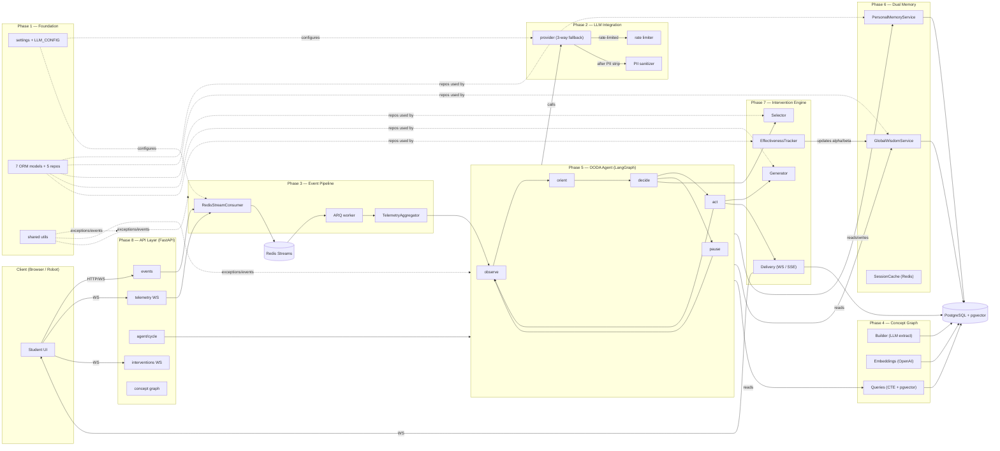

---

## 1. How to Read This Doc

| Section | Question it answers |
|---|---|
| §2 Phase Roster | What does each of the 9 phases do? |
| §3 Phase Interconnection | How do they call each other? |
| §4 End-to-End Request Trace | What happens when a student makes one wrong attempt? |
| §5 Data Flow | How does state move through the system? |
| §6 Tech Stack | What software does each layer use? |
| §7 Where to Look | Map from concept to file path |
| §8 Per-phase detailed diagrams | Pointer to the per-phase `00-system-design.md` files |

For **line-by-line file documentation**, see the original phase READMEs
(`docs/phase-01-foundation/01-pyproject-toml.md` etc.) — those were already
authored; this document only adds the visual / cross-phase layer.

---

## 2. The 9 Phases — What Each Does

The project is deliberately split into 9 sequential, dependency-ordered
phases. Each phase is a strict dependency of the next, so the system can be
built bottom-up.

| # | Phase | One-line summary | Key files | Detailed diagrams |
|---|---|---|---|---|
| 1 | **Foundation** | Project skeleton, Pydantic settings, async SQLAlchemy engine, 7 ORM models, 5 repositories, shared utilities, docker-compose | `pyproject.toml`, `src/config/`, `src/db/`, `src/shared/`, `docker-compose.yml` | [phase-01-foundation/00-system-design.md](phase-01-foundation/00-system-design.md) |
| 2 | **LLM Integration** | One factory (`get_llm_for_purpose`) that picks the right model per task and falls back across 3 providers; rate limiter; PII sanitizer | `src/llm/provider.py`, `rate_limiter.py`, `sanitizer.py`, `src/config/llm_config.py` | [phase-02-llm/00-system-design.md](phase-02-llm/00-system-design.md) |
| 3 | **Event Pipeline** | Redis Streams event spine, Pydantic schemas, telemetry aggregator with 30 s / 2 m / 5 m windows, ARQ background worker | `src/ingestion/` | [phase-03-event-pipeline/00-system-design.md](phase-03-event-pipeline/00-system-design.md) |
| 4 | **Concept Graph** | Knowledge graph of robotics concepts: LLM extraction, OpenAI embeddings, dedup, recursive-CTE prerequisite walk, pgvector semantic search | `src/concept_graph/` | [phase-04-concept-graph/00-system-design.md](phase-04-concept-graph/00-system-design.md) |
| 5 | **OODA Agent Core** | LangGraph state machine: 5 nodes (Observe, Orient, Decide, Act, Pause) cycling on a typed `OODAState`; 6 tool groups; 4 prompt templates; PG checkpointer with in-memory fallback | `src/agent/` | [phase-05-ooda-agent/00-system-design.md](phase-05-ooda-agent/00-system-design.md) |
| 6 | **Dual Memory** | Per-user (Redis session cache + PostgreSQL profile) **and** per-concept-per-arm Thompson parameters + population benchmarks | `src/memory/` | [phase-06-dual-memory/00-system-design.md](phase-06-dual-memory/00-system-design.md) |
| 7 | **Intervention Engine** | Selector (candidates by heuristics + global wisdom boost) → Thompson sampling → LLM-generated content → WebSocket / SSE delivery → effectiveness feedback | `src/intervention/` | [phase-07-intervention-engine/00-system-design.md](phase-07-intervention-engine/00-system-design.md) |
| 8 | **API Layer** | FastAPI app with lifespan-managed Redis, 5 routers under `/api/v1/ai`, dependency injection, CORS, validation handlers, WebSocket delivery | `src/api/` | [phase-08-api-layer/00-system-design.md](phase-08-api-layer/00-system-design.md) (alt: [phase-08-api/00-system-design.md](phase-08-api/00-system-design.md)) |
| 9 | **Testing & Demo** | 21 unit tests (5 files) + 3 demos (CLI, web SSR, interactive form) that exercise the full OODA loop end-to-end | `tests/`, `demo.py`, `web_demo.py`, `interactive_demo.py` | [phase-09-testing-and-demo/00-system-design.md](phase-09-testing-and-demo/00-system-design.md) (alt: [phase-09-testing-demo/00-system-design.md](phase-09-testing-demo/00-system-design.md)) |

---

## 3. Phase Interconnection

### 3.1 — Strict build order (compile-time dependency)

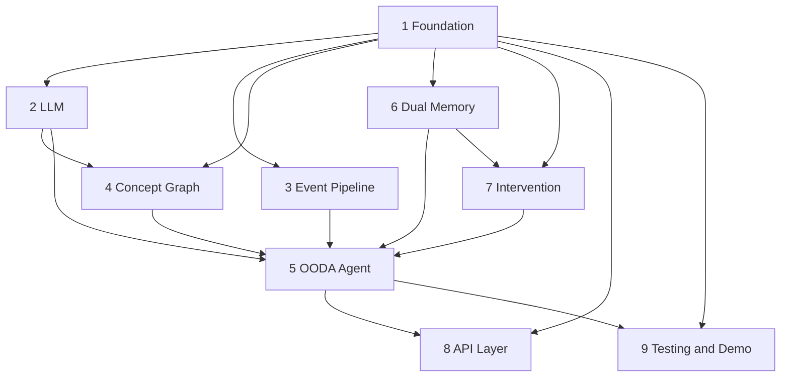

Phase 5 (OODA) sits in the center because it integrates Phase 2, 3, 4, 6,
and 7. Phase 8 wraps everything in HTTP/WS. Phase 9 verifies everything.

### 3.2 — Runtime call graph (who calls whom at request time)

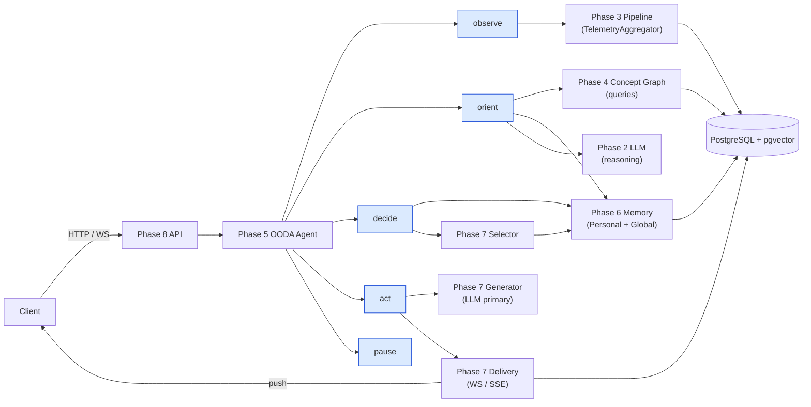

### 3.3 — Phase 2 ↔ Phase 5: which nodes call which LLM purpose

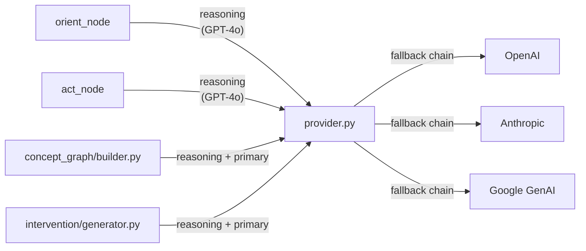

### 3.4 — Phase 5 ↔ Phase 6: who reads/writes which memory

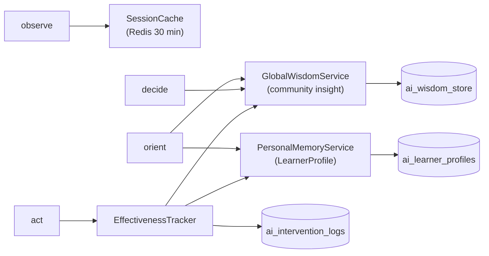

### 3.5 — Phase 5 ↔ Phase 7: decide → select → generate → deliver

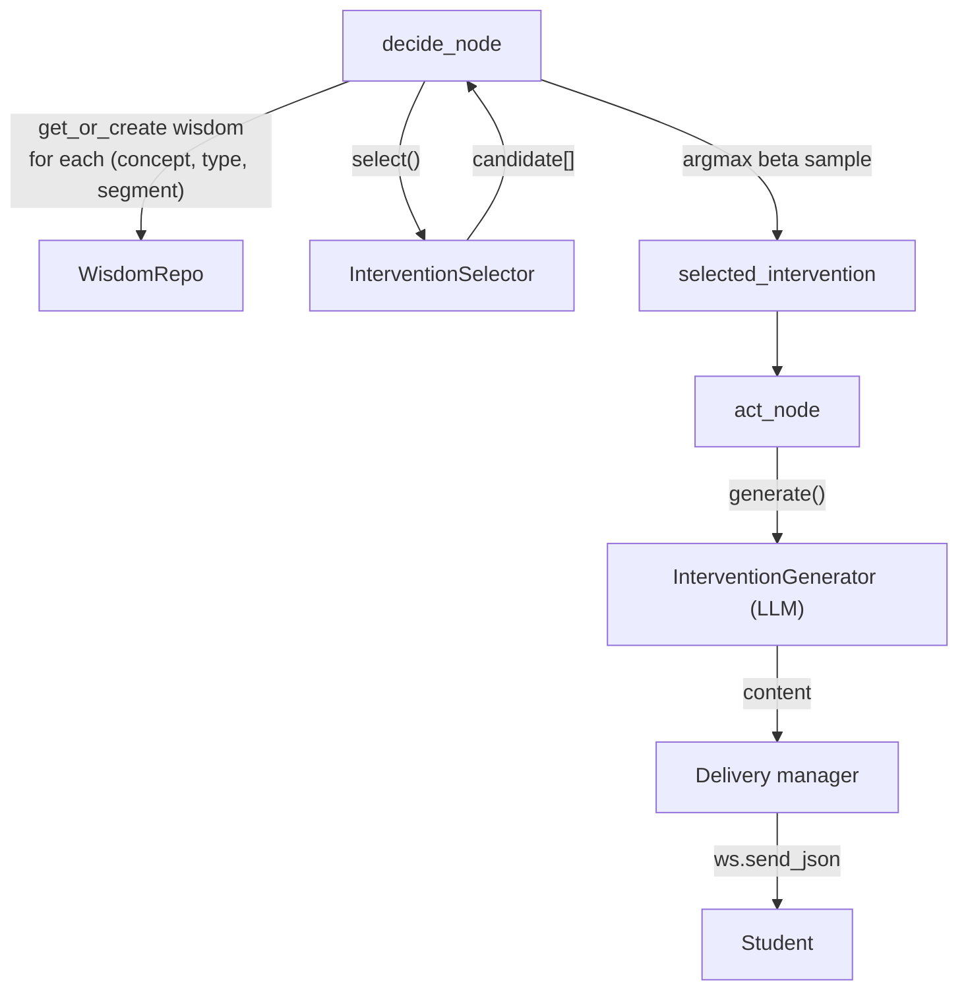

### 3.6 — Phase 3 ↔ Phase 5: how events reach the OBSERVE node

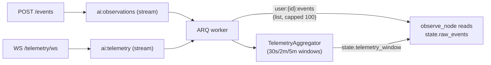

### 3.7 — Phase 4 ↔ Phase 5: how ORIENT reasons about the graph

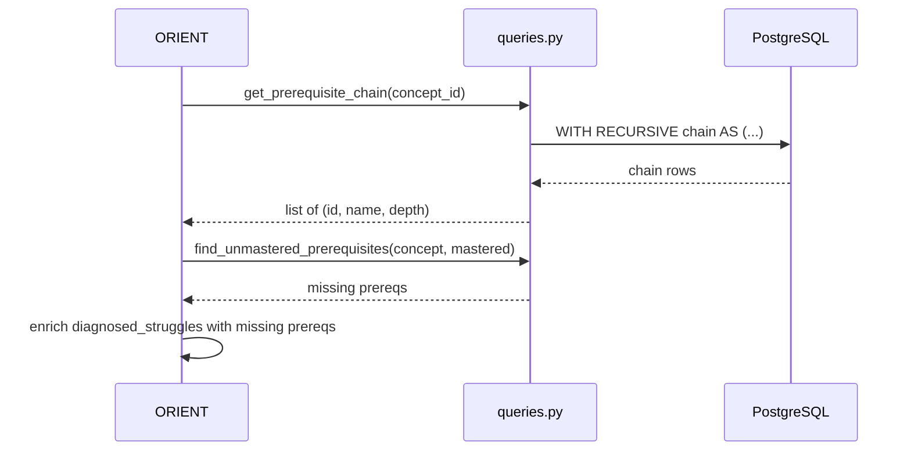

---

## 4. End-to-End Request Trace

The single most important scenario in the system: **student submits one
wrong answer; an intervention is delivered within one OODA cycle.**

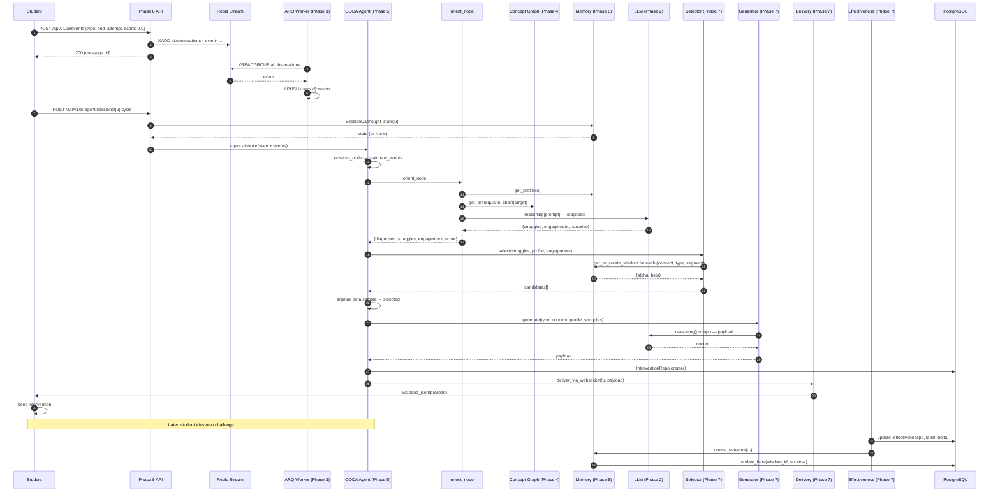

---

## 5. State & Data Flow

### 5.1 — Where each piece of state lives

| State | Location | Lifetime | Owner |
|---|---|---|---|
| Per-request `OODAState` | LangGraph runtime | Single cycle | Phase 5 |
| Session state | Redis `session:{id}` | 30 min TTL | Phase 6 |
| Learner profile | PostgreSQL `ai_learner_profiles` | Persistent | Phase 6 |
| Intervention log | PostgreSQL `ai_intervention_logs` | Persistent | Phase 7 |
| Wisdom (α, β) | PostgreSQL `ai_wisdom_store` | Persistent | Phase 6 |
| Population stats | PostgreSQL `ai_population_benchmarks` | Persistent | Phase 6 |
| Concept nodes | PostgreSQL `ai_concepts` (vector) | Persistent | Phase 4 |
| Concept edges | PostgreSQL `ai_concept_edges` | Persistent | Phase 4 |
| Telemetry windows | In-process `TelemetryAggregator._windows` | Process lifetime | Phase 3 |
| Pending events | Redis Stream `ai:*` | Until consumed | Phase 3 |
| Per-user event queue | Redis List `user:{id}:events` | Capped 100 | Phase 3 |
| API keys | `.env` (gitignored) | Persistent | Phase 1 |

### 5.2 — Lifecycle of one state field

How `diagnosed_struggles` flows from creation to consumption:

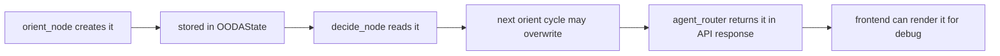

### 5.3 — Lifecycle of one wisdom record

How a Thompson arm is born, sampled, and updated:

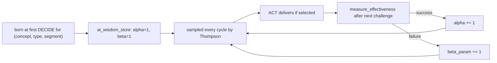

---

## 6. Tech Stack Matrix

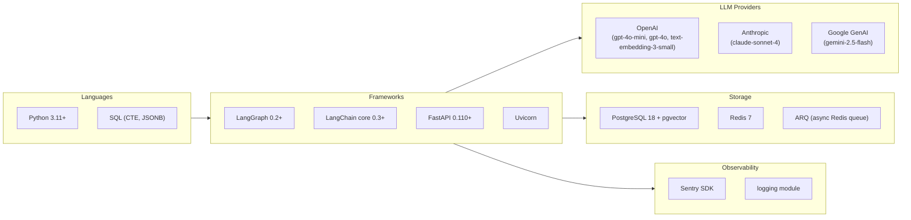

---

## 7. Concept → File Index

| Concept | File | Phase |
|---|---|---|
| Pydantic settings | `src/config/settings.py` | 1 |
| LLM model routing | `src/config/llm_config.py` | 1 |
| Async engine | `src/db/engine.py` | 1 |
| Learner profile model | `src/db/models/ai_learner_profile.py` | 1 |
| Wisdom store model | `src/db/models/ai_wisdom_store.py` | 1 |
| Concept model | `src/db/models/ai_concept.py` | 1 |
| Repo for learner | `src/db/repositories/learner_profile_repo.py` | 1 |
| Repo for wisdom | `src/db/repositories/wisdom_repo.py` | 1 |
| Repo for concepts | `src/db/repositories/concept_repo.py` | 1 |
| LLM factory | `src/llm/provider.py` | 2 |
| Rate limiter | `src/llm/rate_limiter.py` | 2 |
| PII scrubber | `src/llm/sanitizer.py` | 2 |
| Redis stream consumer | `src/ingestion/consumer.py` | 3 |
| Telemetry aggregator | `src/ingestion/aggregator.py` | 3 |
| ARQ worker | `src/ingestion/worker.py` | 3 |
| Concept graph builder | `src/concept_graph/builder.py` | 4 |
| Embeddings | `src/concept_graph/embeddings.py` | 4 |
| Prerequisite CTE | `src/concept_graph/queries.py` | 4 |
| OODA state | `src/agent/state.py` | 5 |
| LangGraph wiring | `src/agent/graph.py` | 5 |
| observe node | `src/agent/nodes/observe.py` | 5 |
| orient node | `src/agent/nodes/orient.py` | 5 |
| decide node | `src/agent/nodes/decide.py` | 5 |
| act node | `src/agent/nodes/act.py` | 5 |
| pause node | `src/agent/nodes/pause.py` | 5 |
| Agent prompts | `src/agent/prompts/` | 5 |
| Agent tools | `src/agent/tools/` | 5 |
| Personal memory | `src/memory/personal.py` | 6 |
| Global wisdom | `src/memory/global_wisdom.py` | 6 |
| Session cache | `src/memory/session_cache.py` | 6 |
| Population benchmarks | `src/memory/population_benchmarks.py` | 6 |
| Intervention selector | `src/intervention/selector.py` | 7 |
| Intervention generator | `src/intervention/generator.py` | 7 |
| Effectiveness tracker | `src/intervention/effectiveness.py` | 7 |
| Delivery | `src/intervention/delivery.py` | 7 |
| FastAPI app | `src/api/app.py` | 8 |
| Dependencies | `src/api/dependencies.py` | 8 |
| Events router | `src/api/routers/events.py` | 8 |
| Telemetry router | `src/api/routers/telemetry.py` | 8 |
| Agent router | `src/api/routers/agent.py` | 8 |
| Interventions router | `src/api/routers/interventions.py` | 8 |
| Concept graph router | `src/api/routers/concept_graph.py` | 8 |
| CLI demo | `demo.py` | 9 |
| Web demo | `web_demo.py` | 9 |
| Interactive demo | `interactive_demo.py` | 9 |
| Unit tests | `tests/` | 9 |

---

## 8. Per-Phase Detailed Diagrams

Each phase folder contains a `00-system-design.md` with multiple Mermaid
diagrams specific to that phase. Below is what each contains.

### 8.1 — [Phase 1 Foundation](phase-01-foundation/00-system-design.md)
1. Layered view of Phase 1
2. Database ER diagram
3. Configuration resolution chain
4. Engine boot sequence
5. Repository pattern
6. Exception hierarchy
7. Container view (docker-compose)
8. Scope mindmap
9. Reading order

### 8.2 — [Phase 2 LLM](phase-02-llm/00-system-design.md)
1. Provider fallback chain
2. Purpose-to-model routing
3. Sliding-window rate limiter
4. PII sanitizer pipeline
5. Where LLM calls happen
6. Defense-in-depth (no API key)
7. Component map

### 8.3 — [Phase 3 Event Pipeline](phase-03-event-pipeline/00-system-design.md)
1. End-to-end event flow
2. Telemetry windowing
3. ARQ worker lifecycle
4. Consumer group setup
5. Stream names table
6. Schema validation boundary
7. Component map

### 8.4 — [Phase 4 Concept Graph](phase-04-concept-graph/00-system-design.md)
1. Graph overview
2. Build pipeline detail
3. Dedup threshold
4. Recursive CTE walk
5. Semantic search with pgvector
6. Data model detail
7. OODA usage
8. Component map

### 8.5 — [Phase 5 OODA Agent](phase-05-ooda-agent/00-system-design.md)
1. Full OODA loop (authoritative)
2. State lifecycle through one cycle
3. State schema
4. OBSERVE node
5. ORIENT node
6. DECIDE node (Thompson)
7. ACT node
8. PAUSE node
9. Checkpointer strategy
10. Tool surface
11. Prompt files
12. Component map

### 8.6 — [Phase 6 Dual Memory](phase-06-dual-memory/00-system-design.md)
1. Memory layers
2. Personal memory service
3. Global wisdom service
4. Session cache implementations
5. Thompson update loop
6. Population vs individual
7. Benchmark refresh
8. Component map

### 8.7 — [Phase 7 Intervention Engine](phase-07-intervention-engine/00-system-design.md)
1. High-level pipeline
2. Selector detail
3. Thompson convergence
4. Generator pipeline
5. Challenge generation sub-flow
6. Delivery channels
7. Effectiveness feedback loop
8. Intervention types
9. Component map

### 8.8 — [Phase 8 API Layer](phase-08-api-layer/00-system-design.md)
1. FastAPI topology
2. Router map
3. Event ingestion path
4. Telemetry WebSocket loop
5. Agent cycle endpoint
6. Intervention delivery WS
7. Concept graph endpoints
8. Dependency injection
9. Middleware & exception handlers
10. Component map

### 8.9 — [Phase 9 Testing & Demo](phase-09-testing-and-demo/00-system-design.md)
1. Test categories
2. Fixture map
3. The 5 most-important tests
4. Demo scripts side by side
5. Test pyramid
6. Bugs fixed
7. How tests run
8. CI view
9. Component map

---

## 9. Critical Invariants (Don't Break These)

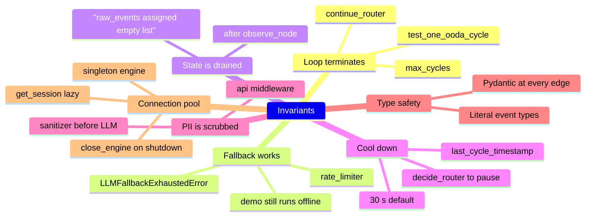

---

## 10. How the Docs Are Organized

```
docs/
├── README.md                 ← original prose overview
├── architecture.md           ← original prose architecture
├── api.md                    ← original prose API spec
├── SYSTEM_DESIGN.md          ← this file (master visual index)
├── concept_graph.md          ← (original) concept-graph deep-dive
├── intervention_types.md     ← (original) intervention catalog
├── phase-01-foundation/
│   ├── 00-system-design.md   ← NEW visual diagrams
│   ├── 01-pyproject-toml.md
│   ├── 02-gitignore-env.md
│   ├── ...
├── phase-02-llm/
│   ├── 00-system-design.md   ← NEW
│   └── 01-provider.md
├── phase-03-event-pipeline/
│   ├── 00-system-design.md   ← NEW
│   └── 01-event-pipeline.md
├── phase-04-concept-graph/
│   ├── 00-system-design.md   ← NEW
│   └── 01-concept-graph.md
├── phase-05-ooda-agent/
│   ├── 00-system-design.md   ← NEW
│   ├── 01-state-and-graph.md
│   ├── 02-nodes.md
│   └── 03-tools-and-prompts.md
├── phase-06-dual-memory/
│   ├── 00-system-design.md   ← NEW
│   └── 01-dual-memory.md
├── phase-07-intervention/
│   ├── 00-system-design.md   ← NEW
│   └── 01-intervention-engine.md
├── phase-07-intervention-engine/
│   └── 00-system-design.md   ← NEW (duplicate folder alias)
├── phase-08-api/
│   ├── 00-system-design.md   ← NEW (duplicate folder alias)
│   └── ... (original 7 files)
├── phase-08-api-layer/
│   ├── 00-system-design.md   ← NEW
│   └── 01-api-layer.md
├── phase-09-testing-and-demo/
│   ├── 00-system-design.md   ← NEW
│   └── 01-testing-and-demo.md
└── phase-09-testing-demo/
    └── 00-system-design.md   ← NEW (duplicate folder alias)
```

> **Note on duplicate folder names.** Two phase-08 and two phase-09 folders
> exist in the repo (likely from a rename). Both have a `00-system-design.md`
> file with the same content. Reading either is fine.

---

## 11. Quick Start (For Readers Who Want to Run It)

```bash
# 1. Bring up infra
docker-compose up -d

# 2. Install
pip install -e ".[dev]"

# 3. Migrate DB
alembic upgrade head

# 4. Seed wisdom store
python scripts/seed_wisdom.py

# 5. Run API
uvicorn src.api.app:app --host 0.0.0.0 --port 8000 --reload

# 6. Or run a one-shot CLI demo (no API keys needed)
python demo.py --event wrong --max-cycles 1

# 7. Or open the interactive demo
python interactive_demo.py
# → http://127.0.0.1:8001

# 8. Run tests
pytest tests/ -v
```

The demos work **offline** thanks to the 3-way LLM fallback (the catch-all
returns hardcoded text when all three providers refuse).
