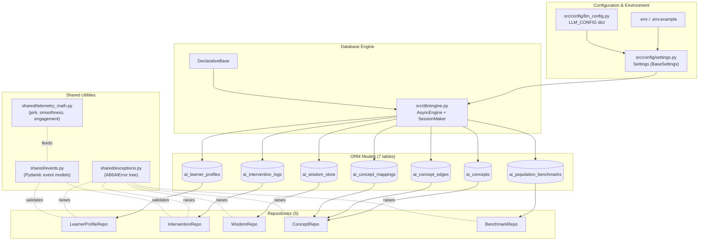
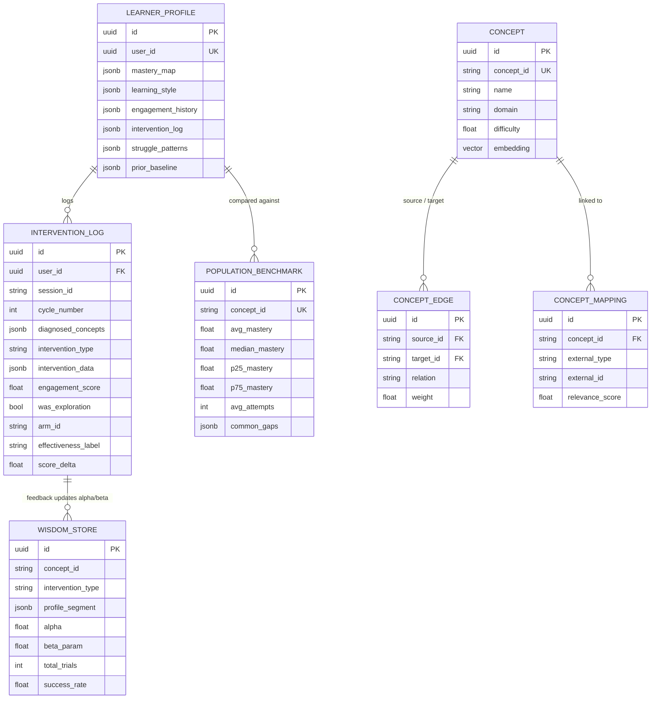
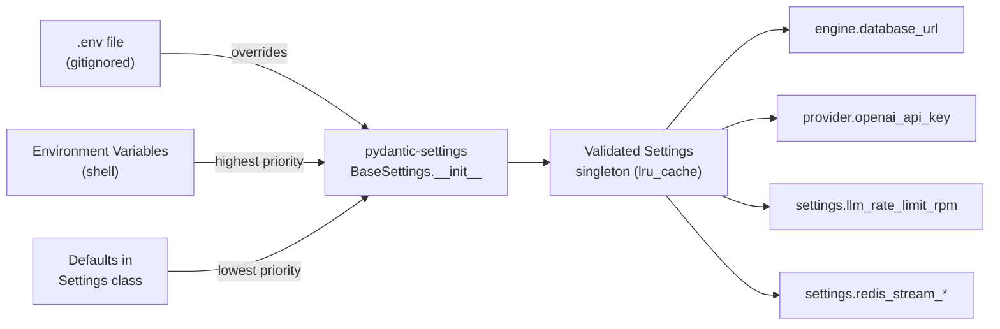
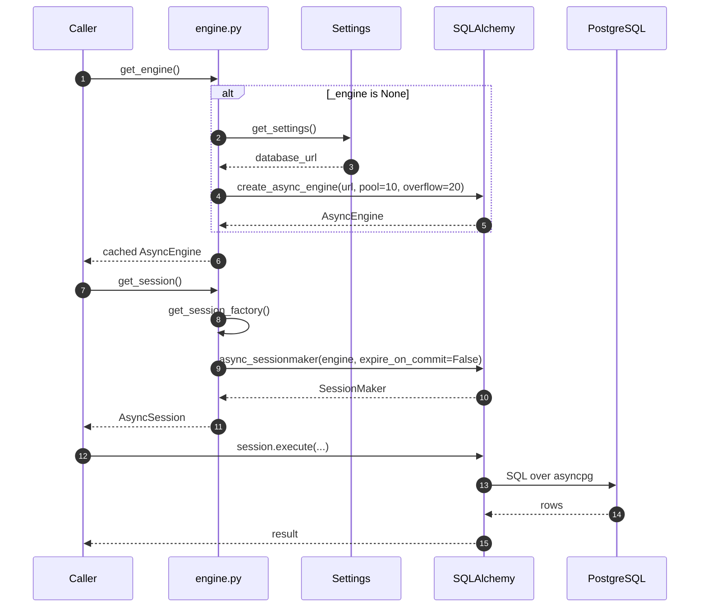
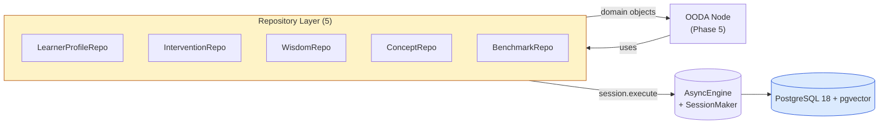
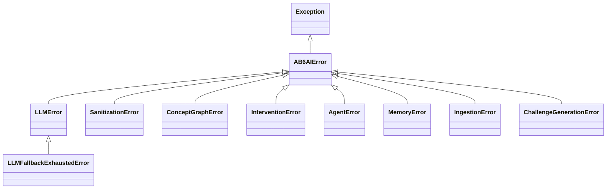
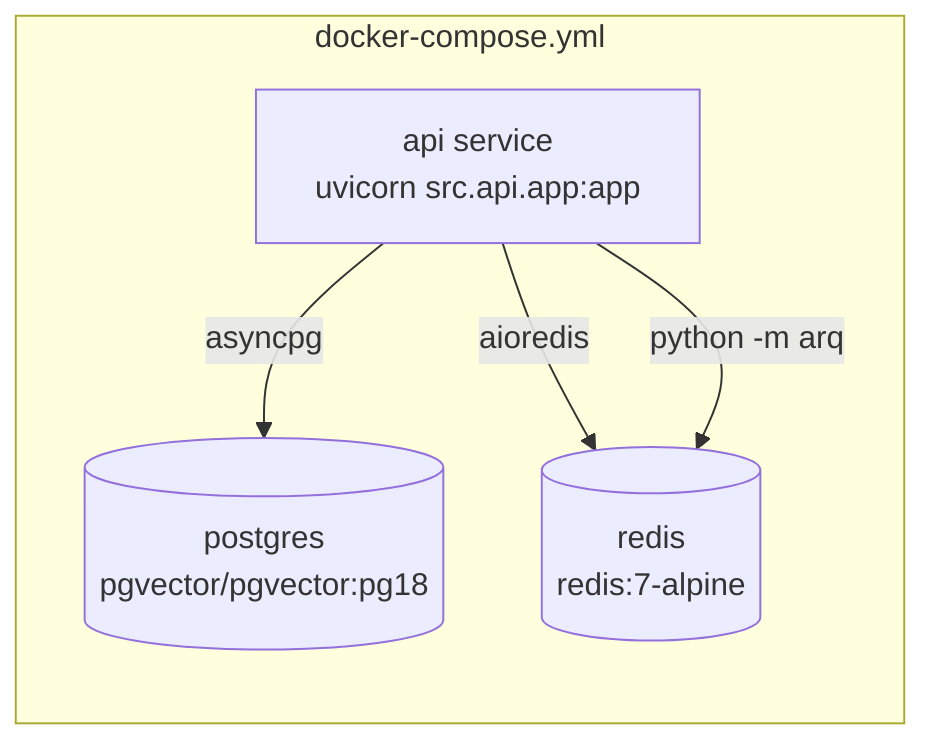
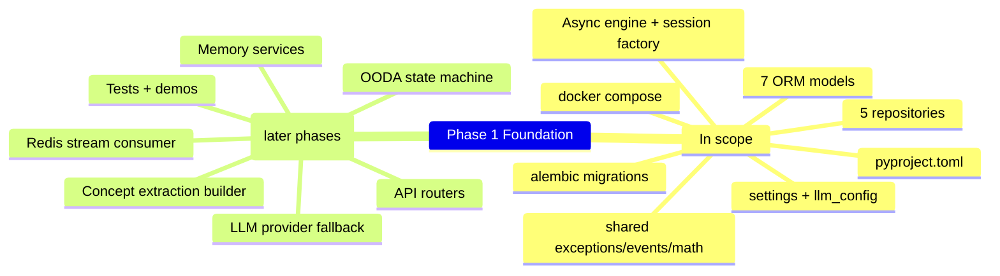
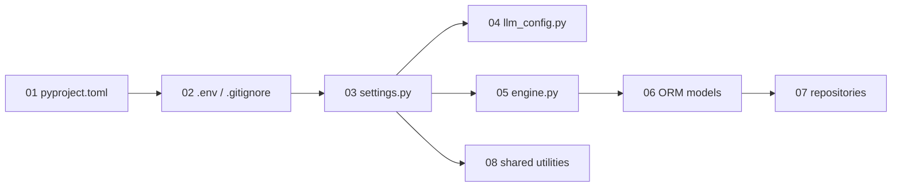

# Phase 1 — Foundation: System Design Diagrams

This file is the **visual map** of Phase 1 (Foundation). It shows how the
project skeleton, configuration, persistence layer, and shared utilities fit
together. All other phases build on top of this layer.

---

## 1.1 — Layered View of Phase 1

Phase 1 produces a strict 4-layer cake. Higher layers depend on lower layers
but never the other way around.

---

## 1.2 — Database Schema (Entity-Relationship)

The 7 ORM models in the `ab6_learning_data` PostgreSQL schema. Foreign-key
relationships are solid arrows; JSON-derived references are dashed.

---

## 1.3 — Configuration Resolution Chain

How a `get_settings()` call flows from `.env` to typed Python object.

---

## 1.4 — Database Engine Boot Sequence

Lazy initialization pattern used everywhere in the project. The engine and
session-factory are only created on first use, then cached for the process
lifetime.

---

## 1.5 — Repository Pattern (How Nodes Reach Data)

Repositories are the **only** path from agent nodes to the database. They
encapsulate SQL and let the rest of the code deal in Python objects.

---

## 1.6 — Exception Hierarchy

---

## 1.7 — Container View (docker-compose)

---

## 1.8 — What Phase 1 Delivers vs. What It Does Not

---

## 1.9 — Reading Order for Phase 1

Read in this order; each file depends on the previous one.
