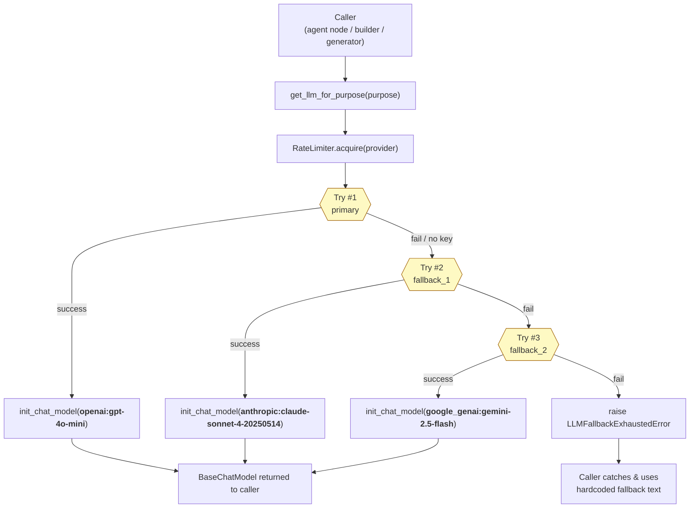
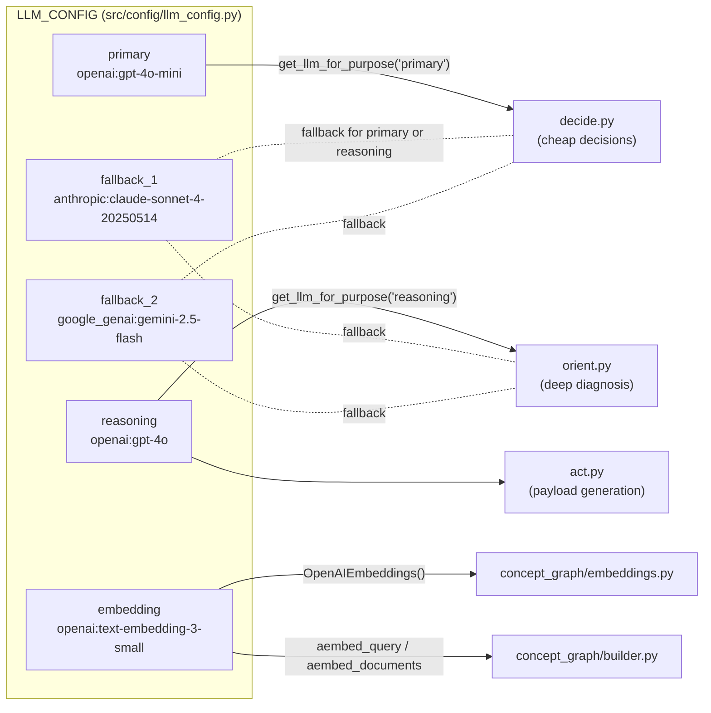
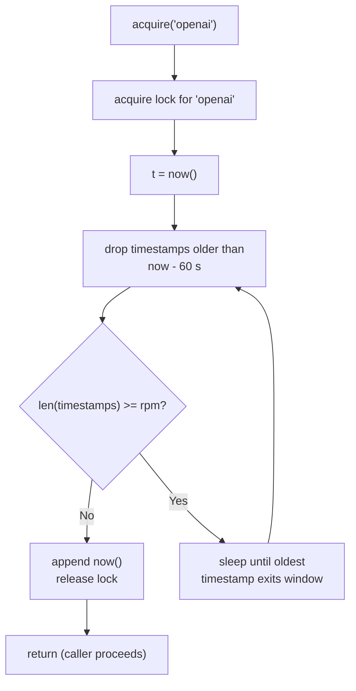
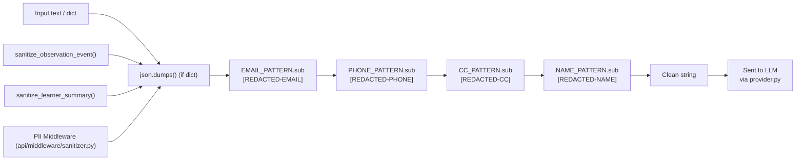
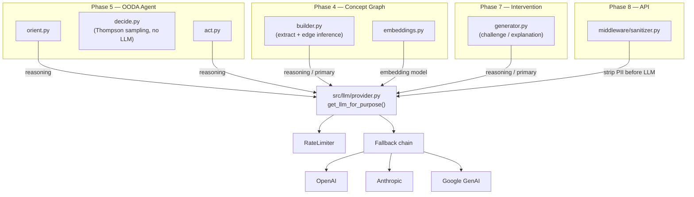
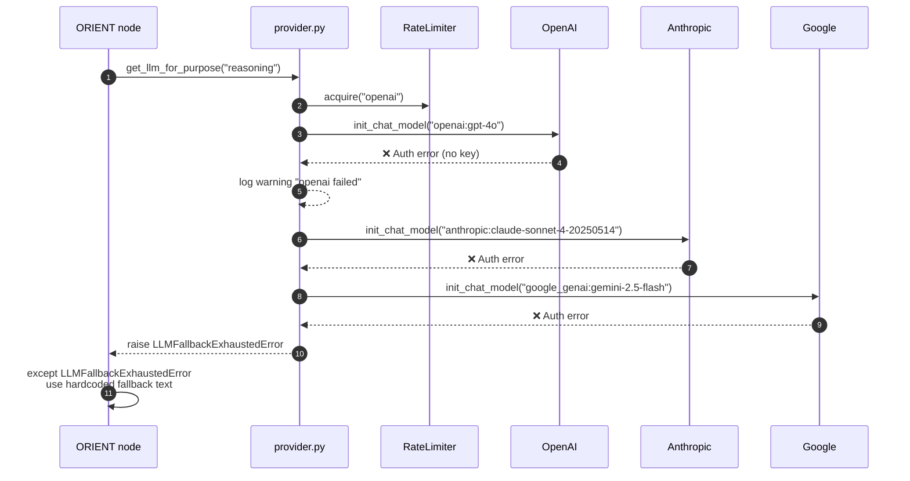
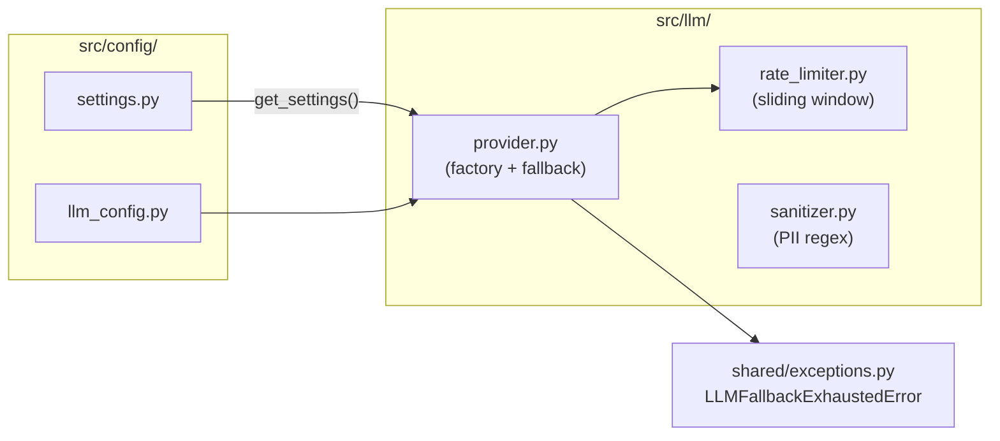

# Phase 2 — LLM Integration: System Design Diagrams

Phase 2 wraps every LLM call behind a single, fault-tolerant provider factory.
Everything that needs an LLM (`orient`, `decide`, `act`, `builder`,
`generator`) goes through `get_llm_for_purpose()`.

---

## 2.1 — Provider Fallback Chain

Three independent providers, one logical interface. If provider A fails the
system seamlessly tries B, then C.

---

## 2.2 — Purpose-to-Model Routing

The same factory switches model class based on **purpose**, not call-site.
Decisions are cheap, diagnoses are smart.

---

## 2.3 — Sliding-Window Rate Limiter

Per-provider 100 RPM cap. Each provider gets its own lock so they don't
interfere with each other.

---

## 2.4 — PII Sanitizer Pipeline

All LLM-bound text is scrubbed through a 4-stage regex chain **before**
leaving the application boundary.

> **Design note:** `NAME_PATTERN` requires the prefix `name:|` `user:|` `student:`
> so legitimate concept names like "Inverse Kinematics" are preserved.

---

## 2.5 — Where LLM Calls Happen Across the System

---

## 2.6 — Defense-in-Depth: What Happens When No API Key Is Set

This is the actual runtime path during the offline demo.

---

## 2.7 — Phase 2 Component Map

