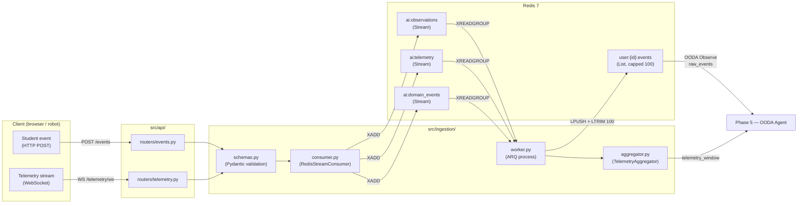
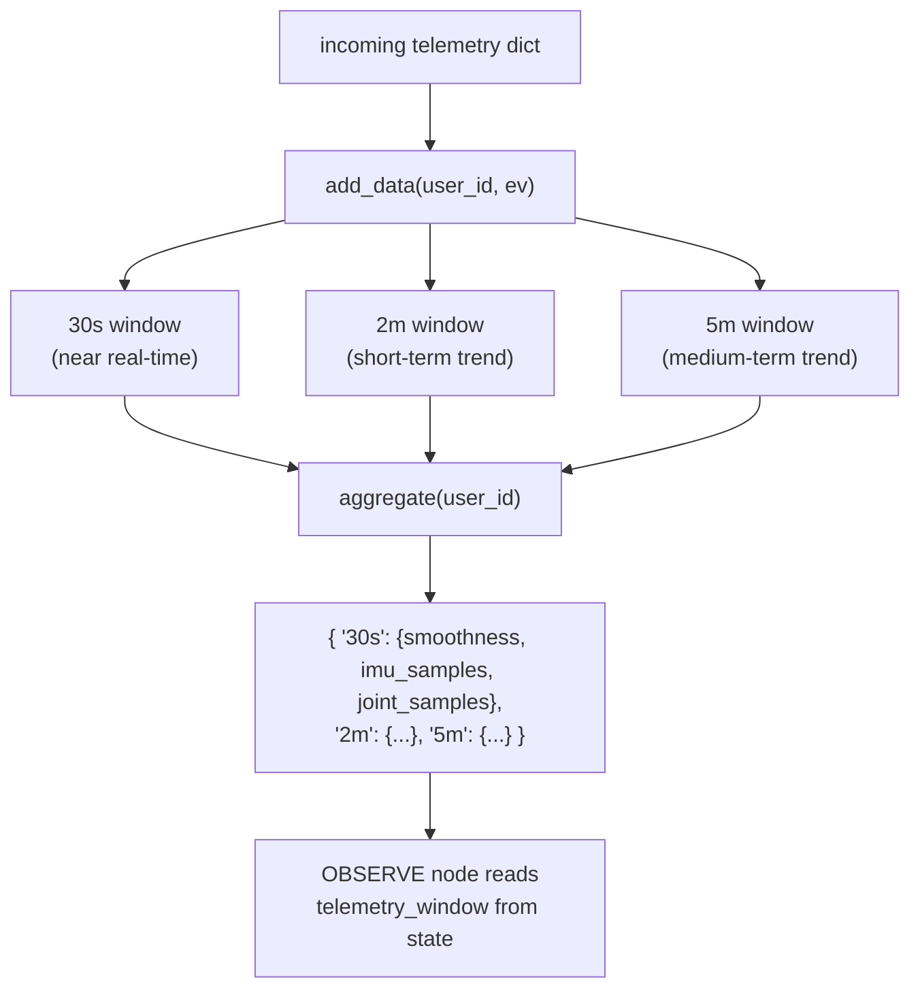
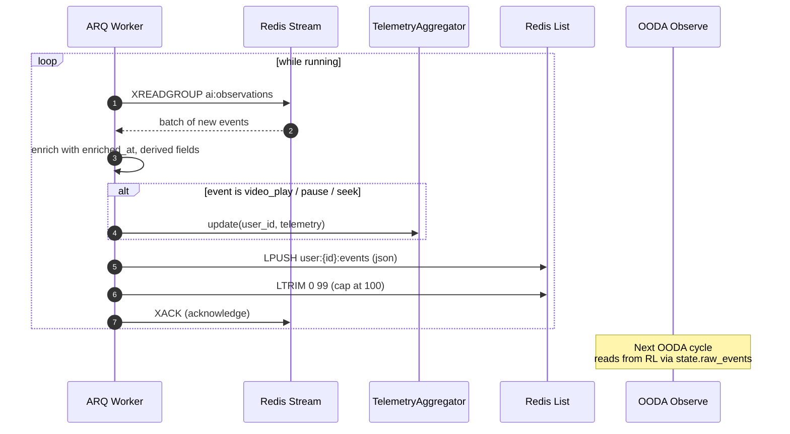
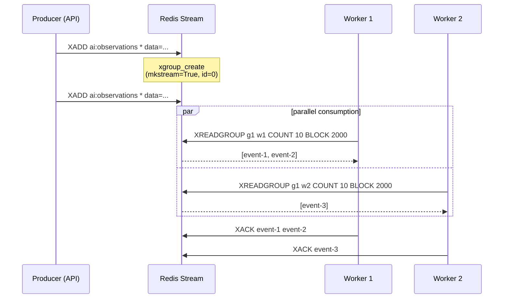
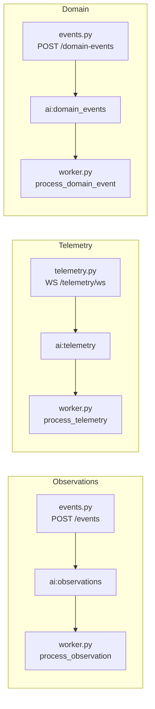
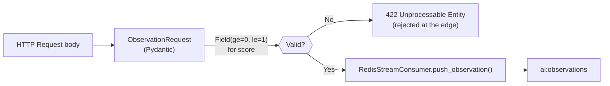
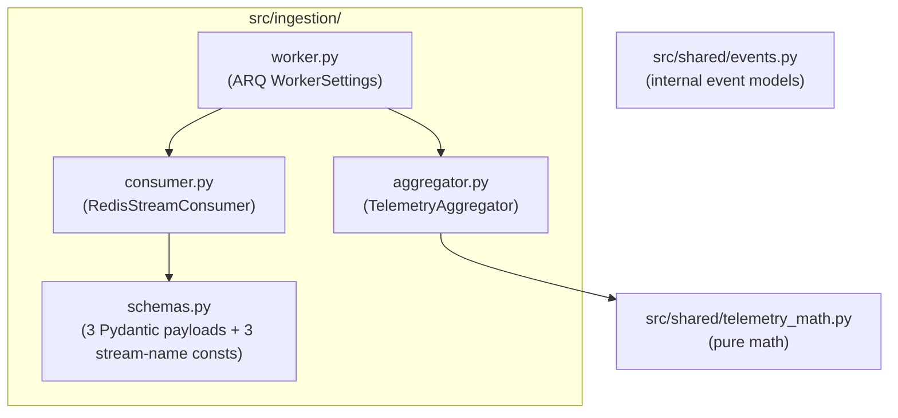

# Phase 3 — Event Pipeline: System Design Diagrams

Phase 3 builds the **event spine** of the system. Every student action (HTTP
event, telemetry WebSocket, domain event) flows through Redis Streams, gets
processed by an ARQ worker, and ends up in the OBSERVE node's `raw_events`
queue.

---

## 3.1 — End-to-End Event Flow

---

## 3.2 — Telemetry Windowing

`TelemetryAggregator` keeps **3 rolling time windows per user** (30 s, 2 min,
5 min). Older data is evicted on every append. This is the data the OBSERVE
node consumes each cycle.

---

## 3.3 — ARQ Worker Lifecycle

---

## 3.4 — Redis Stream Consumer Group Setup

Consumer groups make event processing **reliable and parallelizable**.
Multiple workers can run without losing events.

---

## 3.5 — Stream Names and Their Producers / Consumers

Stream names are defined as constants in `src/config/settings.py` and
re-exported from `src/ingestion/schemas.py`.

---

## 3.6 — Schema Validation Boundary

The Pydantic models in `ingestion/schemas.py` are the **only** types allowed
across the API → Redis boundary. Invalid requests are rejected with a 422
before they ever reach Redis.

---

## 3.7 — Phase 3 Component Map

