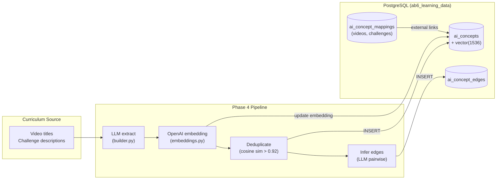
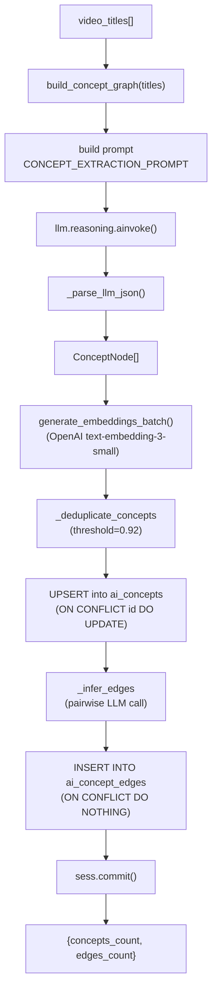
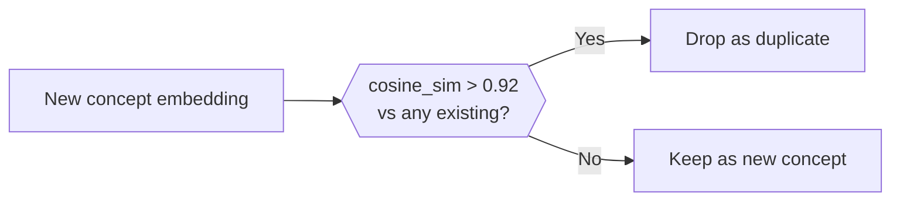
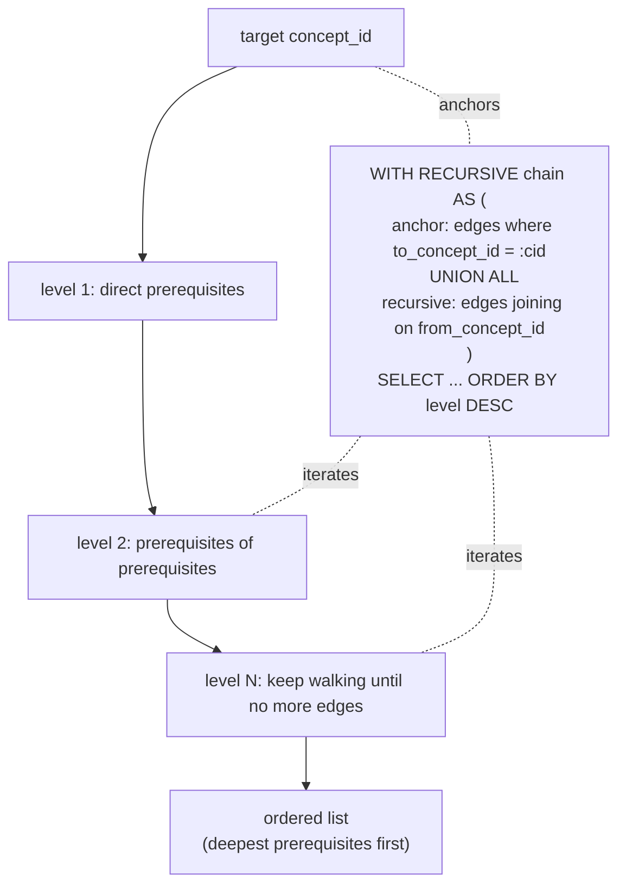
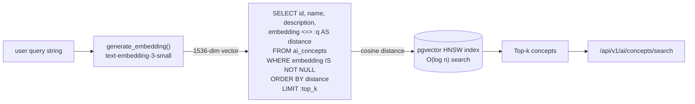
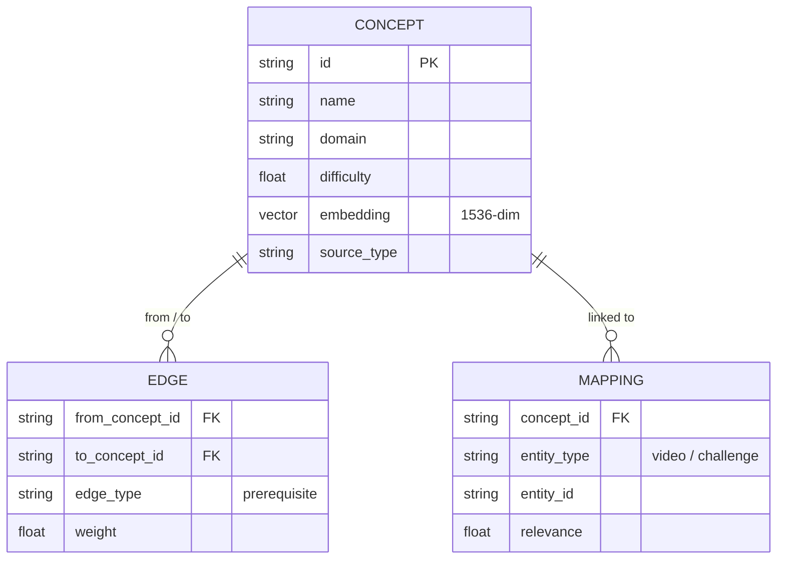
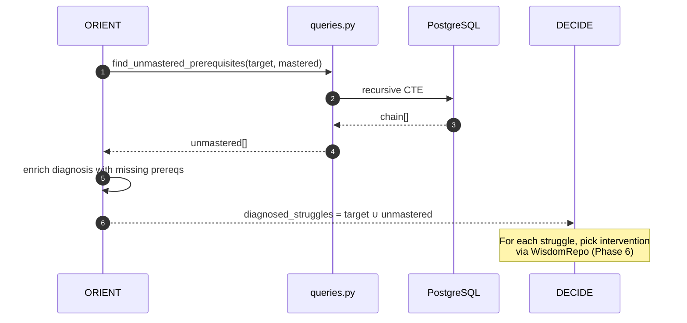
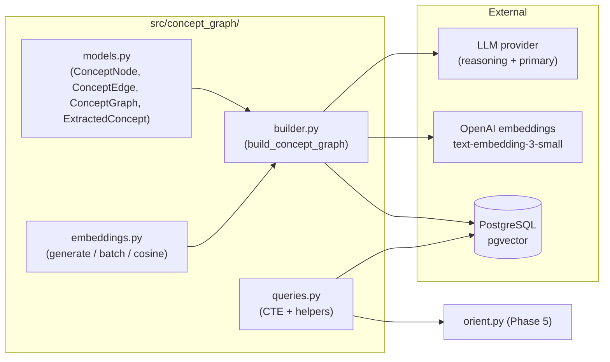

# Phase 4 — Concept Graph: System Design Diagrams

Phase 4 builds the **knowledge graph** of robotics concepts. The ORIENT node
later uses this graph to reason about prerequisite gaps when a student
struggles.

---

## 4.1 — Concept Graph Overview

---

## 4.2 — Build Pipeline (Detailed)

---

## 4.3 — Deduplication Threshold

> 0.92 is empirically tuned. Concept descriptions above this threshold are
> almost always the same concept phrased differently.

---

## 4.4 — Recursive CTE Prerequisite Walk

`get_prerequisite_chain()` walks the prerequisite DAG to arbitrary depth
using a recursive CTE. Same pattern is reused by `find_unmastered_prerequisites`.

---

## 4.5 — Semantic Search with pgvector

The `<=>` operator is pgvector's **cosine distance**. With an HNSW index this
runs in milliseconds even on millions of vectors.

---

## 4.6 — Data Model Detail

Note: ORM columns differ from the Pydantic concept-graph models — ORM
columns live in `src/db/models/ai_concept*.py`, while graph-domain models
live in `src/concept_graph/models.py`.

---

## 4.7 — How the OODA Agent Uses the Graph

---

## 4.8 — Phase 4 Component Map

