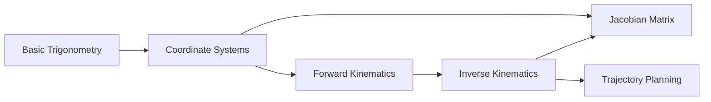

# Phase 4 — Concept Graph

## System Design Reference

Master System Design, "Concept Graph" section. Specified a knowledge graph of educational concepts with vector embeddings for semantic search, prerequisite relationships for learning path discovery, and LLM-based extraction from content.

---

## Task 4.1: Models (`src/concept_graph/models.py`)

### Purpose

Pydantic models for the concept graph data structures. These are used during concept extraction and graph building, separate from the ORM models that persist to PostgreSQL.

### Key Models

```python
class ConceptNode(BaseModel):
    concept_id: str
    name: str
    description: str | None = None
    domain: str | None = None
    difficulty: float = 0.5
    embedding: list[float] | None = None

class ConceptEdge(BaseModel):
    source_id: str
    target_id: str
    relation: str = "prerequisite"
    weight: float = 1.0

class ConceptGraph(BaseModel):
    nodes: list[ConceptNode]
    edges: list[ConceptEdge]

class ExtractedConcept(BaseModel):
    concept_id: str
    name: str
    description: str
    prerequisites: list[str] = []
```

`ExtractedConcept` is the raw output from the LLM. It includes a `prerequisites` list, which the builder later converts to `ConceptEdge` objects.

---

## Task 4.2: Embeddings (`src/concept_graph/embeddings.py`)

### Purpose

Generates vector embeddings for concept descriptions and computes similarity. Uses OpenAI's `text-embedding-3-small` model (1536 dimensions).

### Key Functions

```python
async def generate_embedding(text: str) -> list[float]:
    model = await get_embedding_model()
    embedding = await model.aembed_query(text)
    return embedding

async def batch_embed(concepts: list[ConceptNode]) -> list[ConceptNode]:
    texts = [f"{c.name}: {c.description}" for c in concepts]
    model = await get_embedding_model()
    embeddings = await model.aembed_documents(texts)
    for concept, emb in zip(concepts, embeddings):
        concept.embedding = emb
    return concepts

def cosine_similarity(a: list[float], b: list[float]) -> float:
    a_arr, b_arr = np.array(a), np.array(b)
    return float(np.dot(a_arr, b_arr) / (np.linalg.norm(a_arr) * np.linalg.norm(b_arr)))
```

- `generate_embedding` — Single text → float vector. Used for search queries.
- `batch_embed` — Batch version for efficiency. Uses `aembed_documents` which internally batches API calls.
- `cosine_similarity` — Pure NumPy computation. Used for deduplication (if two concepts have similarity > 0.92, they're duplicates).

---

## Task 4.3: Builder (`src/concept_graph/builder.py`)

### Purpose

The `ConceptGraphBuilder` class orchestrates concept extraction from curriculum content. It:
1. Calls LLM to extract concepts from video titles/challenge descriptions
2. Generates embeddings for each concept
3. Deduplicates by cosine similarity threshold (>0.92)
4. Infers prerequisite relationships from concept ordering
5. Persists to database via `ConceptRepo`

### Key Method

```python
class ConceptGraphBuilder:
    def __init__(self):
        self.llm = get_llm_for_purpose("reasoning")  # GPT-4o for extraction

    async def extract_from_content(self, content: list[str]) -> list[ExtractedConcept]:
        prompt = f"""
        Extract educational concepts from the following curriculum content.
        Return a JSON array of {{concept_id, name, description, prerequisites}}.
        Content: {json.dumps(content)}
        """
        result = await self.llm.ainvoke([
            {"role": "system", "content": EXTRACT_SYSTEM_PROMPT},
            {"role": "user", "content": prompt},
        ])
        raw = result.content
        return [ExtractedConcept(**item) for item in json.loads(raw)]

    async def build(self, content: list[str]) -> ConceptGraph:
        concepts = await self.extract_from_content(content)
        concepts = await batch_embed(concepts)
        
        # Deduplication
        deduped = []
        for c in concepts:
            is_dup = False
            for existing in deduped:
                if cosine_similarity(c.embedding, existing.embedding) > 0.92:
                    is_dup = True
                    break
            if not is_dup:
                deduped.append(c)
        
        # Edge inference
        edges = []
        for c in deduped:
            for prereq_id in c.prerequisites:
                if any(p.concept_id == prereq_id for p in deduped):
                    edges.append(ConceptEdge(source_id=prereq_id, target_id=c.concept_id))
        
        return ConceptGraph(nodes=deduped, edges=edges)
```

**Deduplication threshold of 0.92:** Empirically determined. Concept descriptions with cosine similarity > 0.92 are almost certainly the same concept described differently.

---

## Task 4.4: Queries (`src/concept_graph/queries.py`)

### Purpose

Raw SQL queries for concept graph traversal. Uses recursive CTEs and pgvector's `<=>` operator.

### Key Functions

```python
async def get_prerequisite_chain(session: AsyncSession, concept_id: str) -> list[dict]:
    query = text("""
        WITH RECURSIVE prereq_chain AS (
            SELECT source_id, target_id, 1 AS depth
            FROM ab6_learning_data.ai_concept_edges
            WHERE target_id = :concept_id AND relation = 'prerequisite'
            UNION ALL
            SELECT e.source_id, e.target_id, pc.depth + 1
            FROM ab6_learning_data.ai_concept_edges e
            JOIN prereq_chain pc ON e.target_id = pc.source_id
        )
        SELECT * FROM prereq_chain ORDER BY depth
    """)
    result = await session.execute(query, {"concept_id": concept_id})
    return result.mappings().all()
```

**Recursive CTE walkthrough:**
1. **Anchor member:** Finds all direct prerequisites of `concept_id` (depth=1)
2. **Recursive member:** For each result, finds its prerequisites (depth+1)
3. Continues until no more edges are found
4. Returns ordered by depth (prerequisites first)

```python
async def semantic_search(session: AsyncSession, embedding: list[float], limit: int = 5) -> list[dict]:
    query = text("""
        SELECT concept_id, name, description,
               embedding <=> :query_embedding AS distance
        FROM ab6_learning_data.ai_concepts
        WHERE embedding IS NOT NULL
        ORDER BY distance
        LIMIT :limit
    """)
    result = await session.execute(query, {
        "query_embedding": str(embedding),
        "limit": limit,
    })
    return result.mappings().all()
```

pgvector's `<=>` operator computes cosine distance. Results are ordered by semantic similarity. With an HNSW index, this runs in O(log n) time even on millions of vectors.

### How It Connects

```
Curriculum Content → ConceptGraphBuilder.extract()
    → LLM extracts concepts → embed → dedup → infer edges
    → persist via ConceptRepo
    ↓
ORIENT node calls get_prerequisite_chain()
    → finds "student struggles with IK → do they know trigonometry?"
    ↓
API router calls semantic_search()
    → "find concepts related to 'joint angles'"
```

### PoC Presentation Idea

Show a concept graph visualization:



When a student struggles with Inverse Kinematics, the agent checks if they've mastered Basic Trigonometry and Coordinate Systems (the prerequisites). If not, it recommends reviewing those first.
