# Phase 5 — OODA Agent Core: System Design Diagrams

The OODA (Observe → Orient → Decide → Act) state machine is the **heart** of
the AB6 AI agent. Phase 5 wires together state, graph, nodes, tools, and
prompts into a single LangGraph `StateGraph` that runs in a continuous loop.

---

## 5.1 — Full OODA Loop (Authoritative)

This is the exact topology from `src/agent/graph.py`:

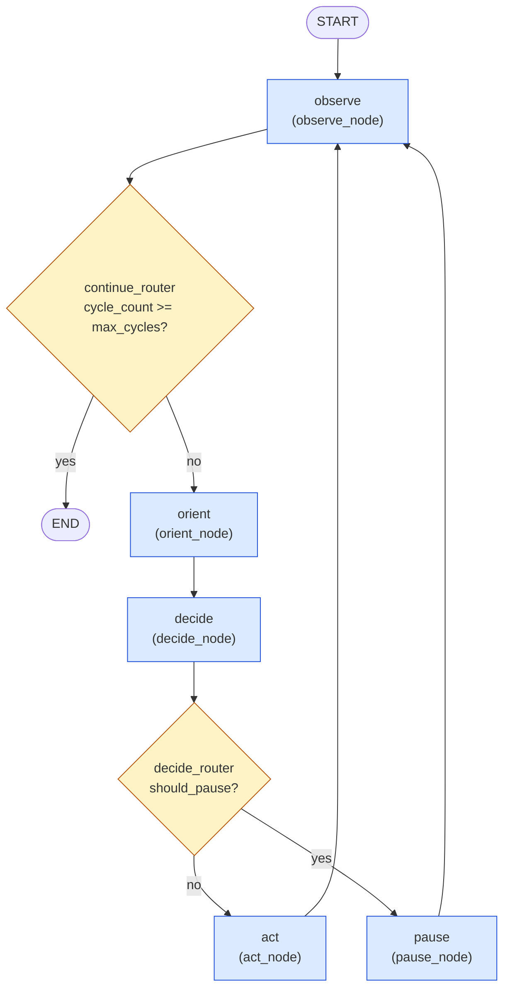

Key invariants from the code:
- `START → observe` is the only entry.
- `observe → {orient | END}` is the **only** terminal edge.
- `orient → decide` is unconditional.
- `decide → {act | pause}` is the cooldown fork.
- `act → observe` and `pause → observe` close the cycle.

---

## 5.2 — State Lifecycle Through One Cycle

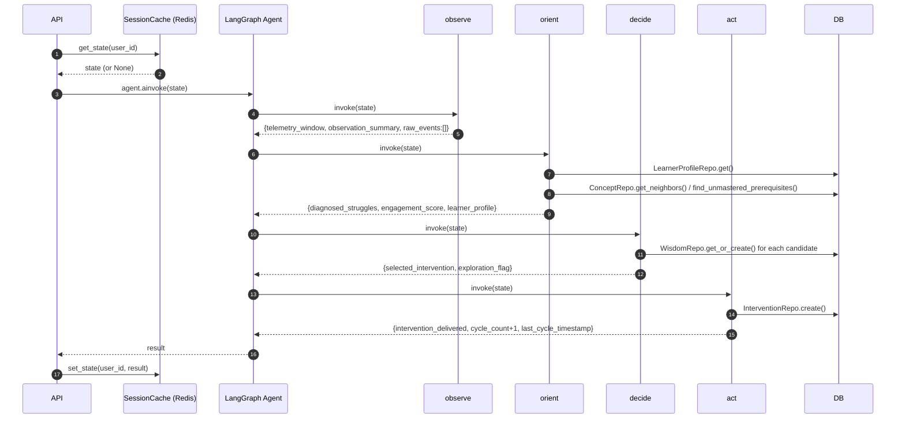

---

## 5.3 — OODAState Schema

`src/agent/state.py` extends `MessagesState` (which gives the accumulating
`messages` field) with the OODA-specific fields. Grouped by which node writes
each field.

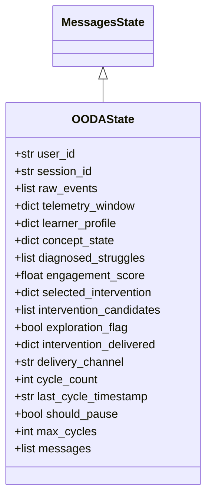

| Field group | Written by | Read by |
|---|---|---|
| `user_id`, `session_id` | `create_initial_state()` | All nodes |
| `raw_events`, `telemetry_window` | ARQ worker / aggregator | observe |
| `learner_profile`, `diagnosed_struggles`, `engagement_score`, `concept_state` | orient | decide, act |
| `selected_intervention`, `intervention_candidates`, `exploration_flag` | decide | act, pause |
| `intervention_delivered`, `delivery_channel`, `cycle_count`, `last_cycle_timestamp` | act | frontend, next cycle |
| `should_pause`, `max_cycles` | pause / `create_initial_state()` | decide_router |

---

## 5.4 — OBSERVE Node

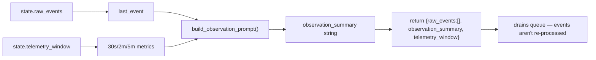

Key invariant: `raw_events` is **cleared** after processing. This is a queue
drain pattern — events are processed exactly once.

---

## 5.5 — ORIENT Node (Diagnosis)

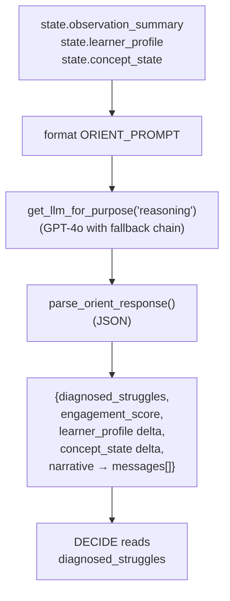

Tools the ORIENT node may invoke via the LLM (Phase 5 §5.8 in the existing
docs):
- `mastery_tools.get_mastery`
- `mastery_tools.get_or_create_profile`
- `concept_tools.traverse_prerequisites`
- `wisdom_tools.get_community_insight`
- `delivery_tools.get_intervention_history`

---

## 5.6 — DECIDE Node (Thompson Sampling)

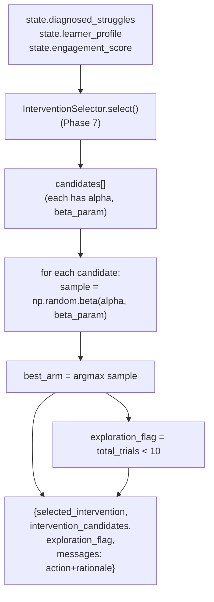

Thompson sampling intuition: each arm's posterior is `Beta(α, β)`. Drawing a
sample and picking the max gives **automatic explore-vs-exploit** — the
agent explores early when posteriors are flat and exploits once posteriors
concentrate around the true win-rate.

---

## 5.7 — ACT Node (Delivery)

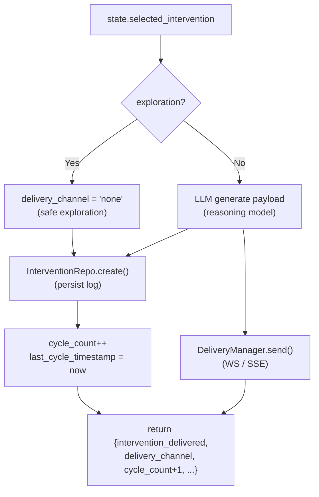

The "safe exploration" pattern: arms with `<10` trials are **logged but not
delivered** to the student. Once enough data exists they go live.

---

## 5.8 — PAUSE Node (Cooldown)

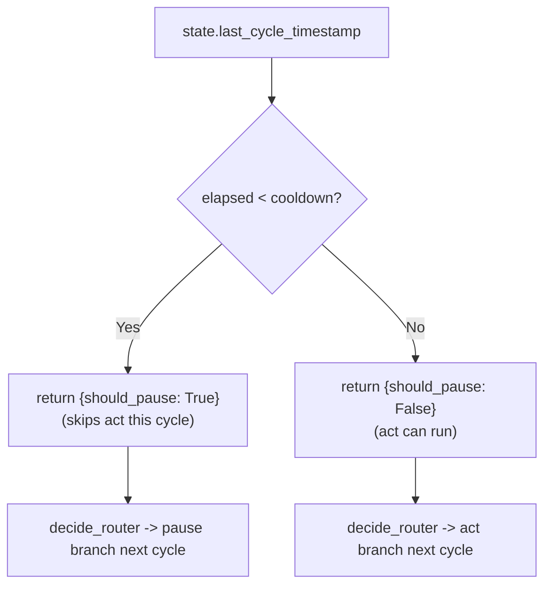

Cooldown defaults to **30 s** (and is also controlled by the
`intervention_cooldown_seconds` setting). Prevents notification flooding.

---

## 5.9 — Checkpointer Strategy (Persistence)

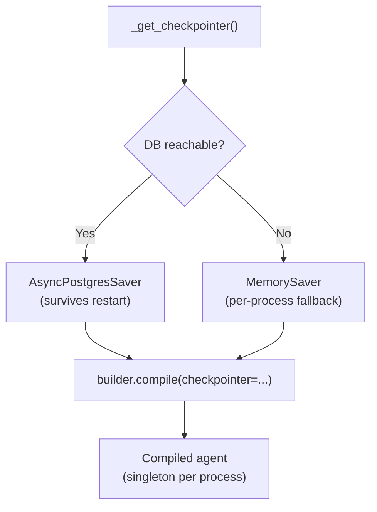

The `.replace("+asyncpg", "")` is critical — `AsyncPostgresSaver` expects a
plain `postgresql://` URL, not the SQLAlchemy `+asyncpg` form.

---

## 5.10 — Tool Surface Available to the LLM

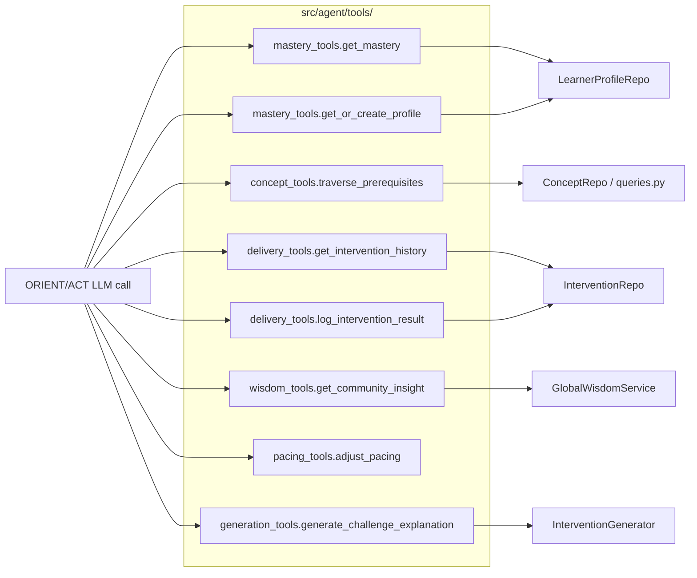

---

## 5.11 — Prompt Files and Where They Are Used

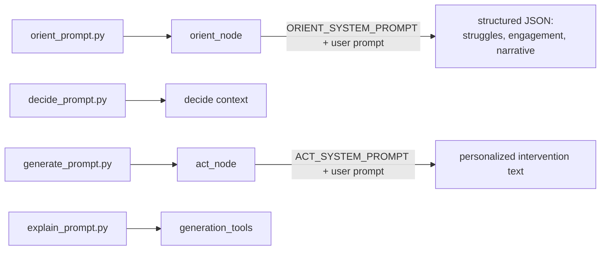

---

## 5.12 — Phase 5 Component Map

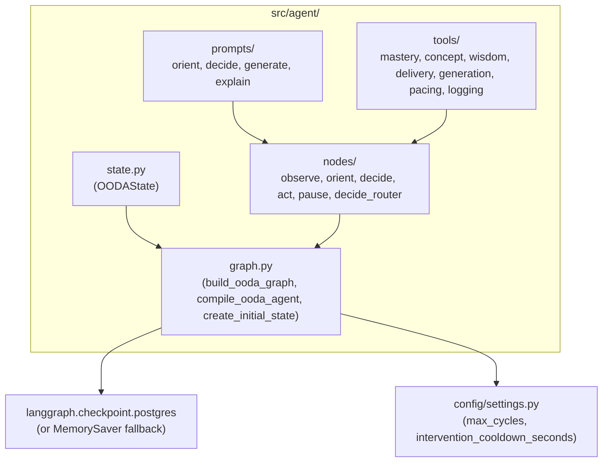
