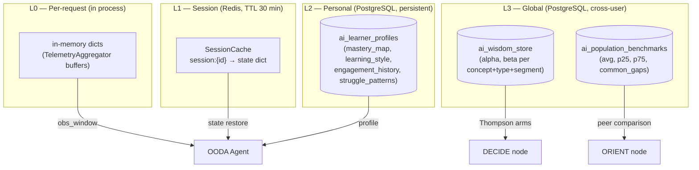
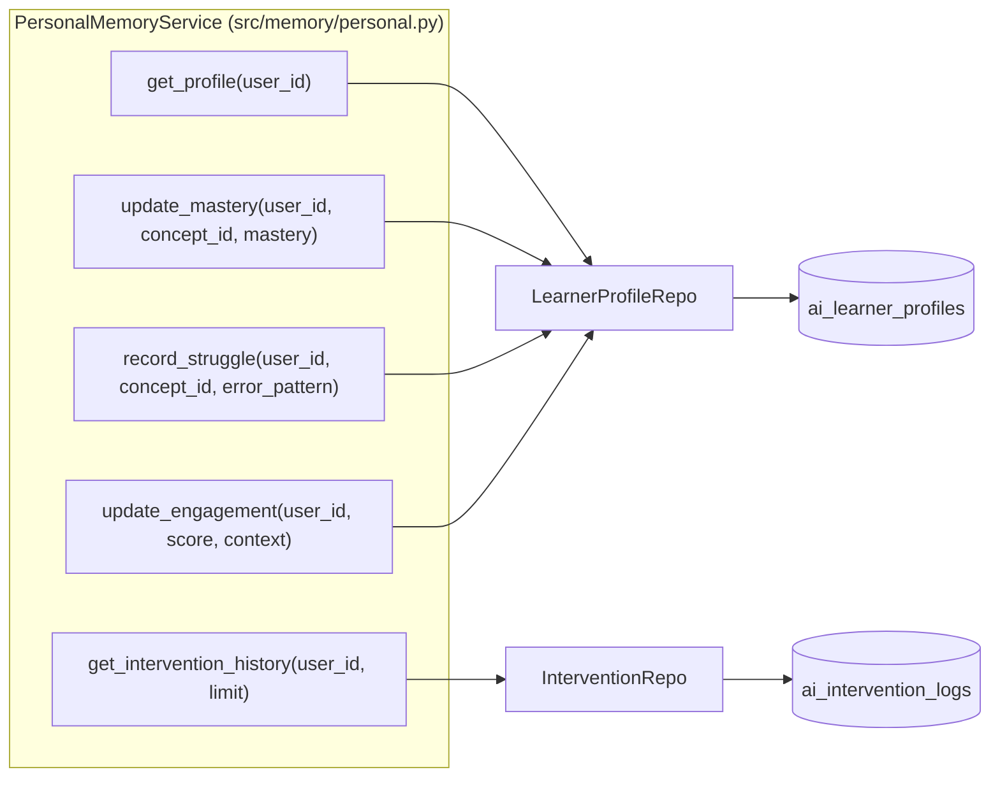
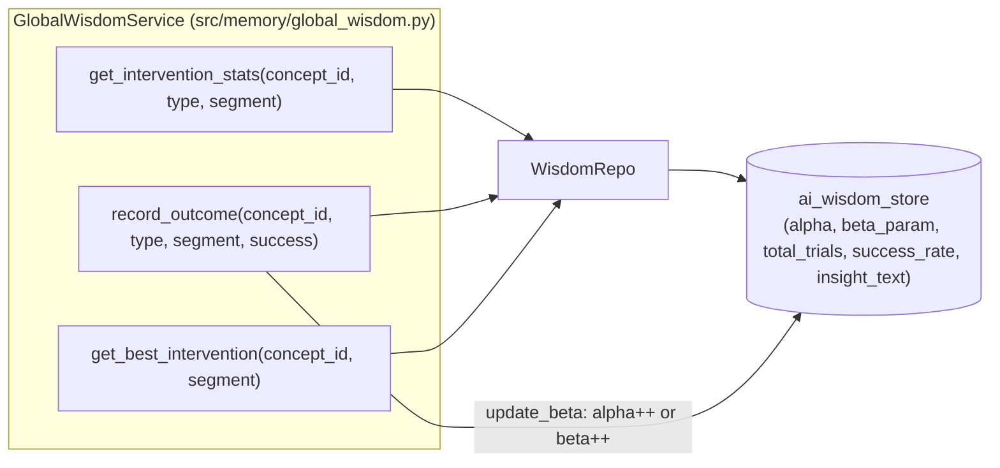
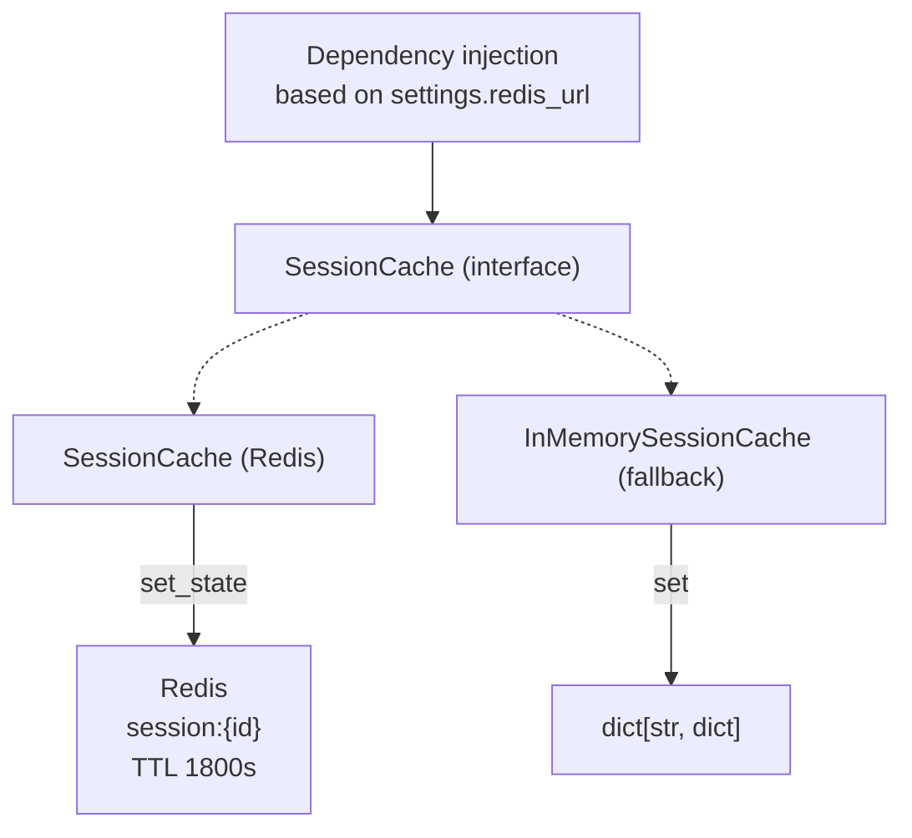
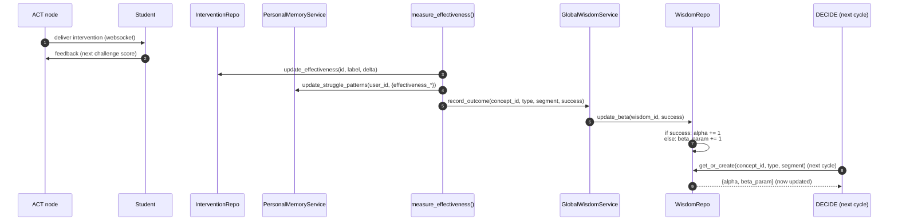
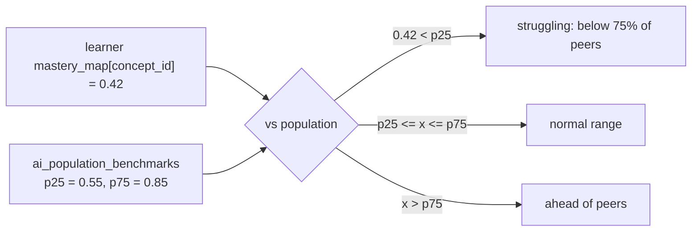
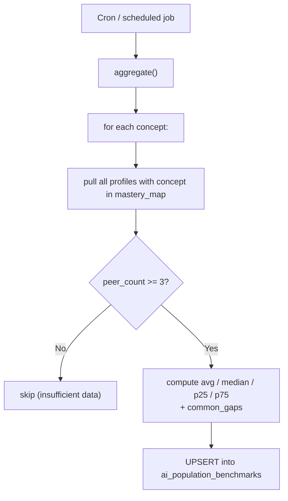
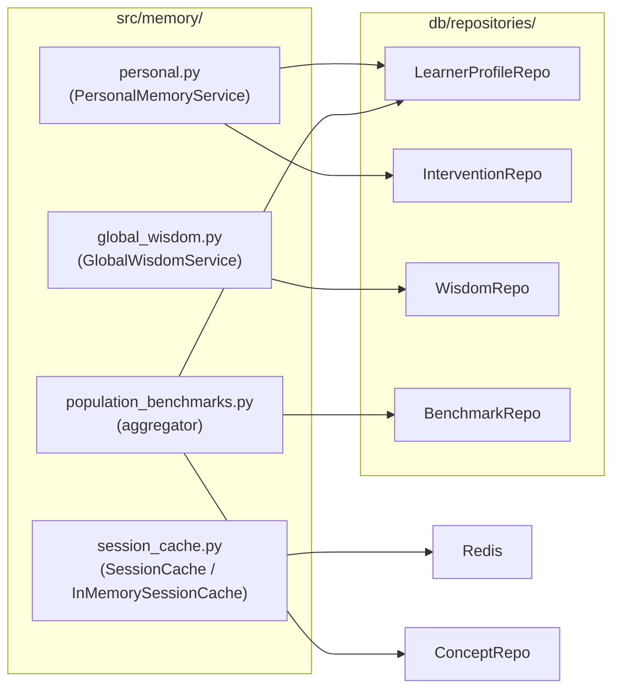

# Phase 6 — Dual Memory: System Design Diagrams

Phase 6 implements the **memory hierarchy** of the agent: short-term (in
process), session (Redis 30 min TTL), long-term profile (PostgreSQL), and
global wisdom (cross-user Thompson parameters).

---

## 6.1 — Memory Layers

Latency hierarchy: L0 < 1 µs · L1 ~1 ms · L2 ~5–15 ms · L3 ~50 ms/concept.

---

## 6.2 — Personal Memory Service

---

## 6.3 — Global Wisdom Service

The `get_best_intervention` method only returns an arm if it has at least
3 trials and the highest observed success rate — a guard against premature
conclusions from a single noisy trial.

---

## 6.4 — Session Cache Implementations (Swappable)

Both implementations expose the same async API (`get`, `set`, `delete`,
`get_active_sessions`) so the rest of the code never needs to branch on which
backend is live.

---

## 6.5 — Thompson Sampling Update Loop

The cycle closes the feedback loop: today's `act` updates the `alpha`/`beta`
that tomorrow's `decide` will sample from.

---

## 6.6 — Population Benchmark vs. Individual Profile

The ORIENT node uses this comparison to weight engagement trends and decide
whether to escalate or de-escalate interventions.

---

## 6.7 — Population Benchmark Refresh

Privacy invariant: only **aggregated statistics** flow into the global store.
Individual learner rows are never joined with PII.

---

## 6.8 — Phase 6 Component Map

