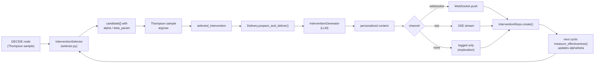
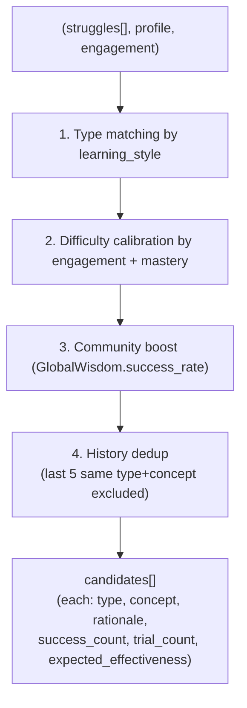
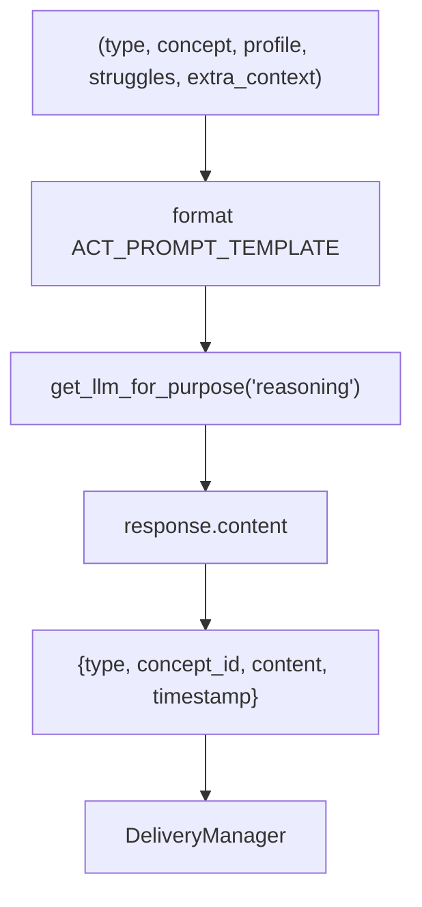
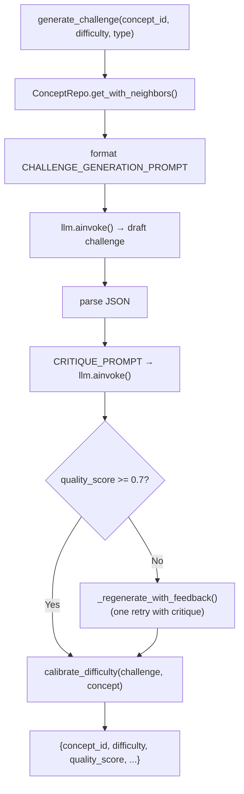
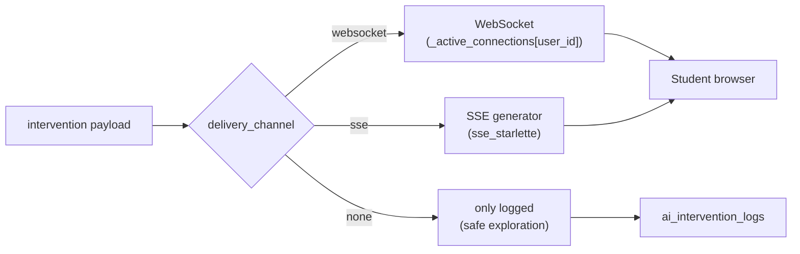
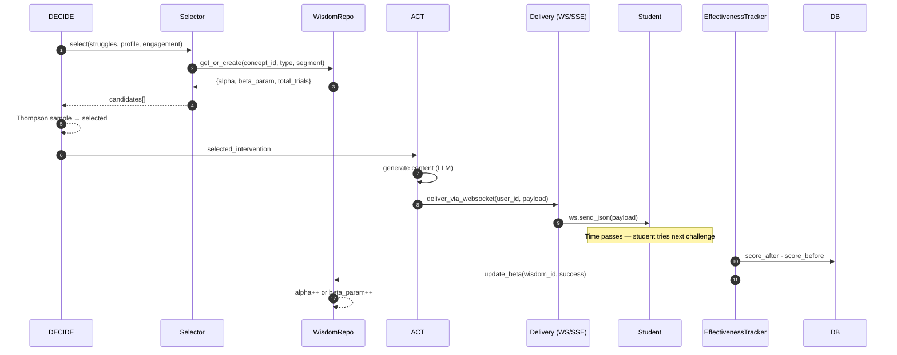
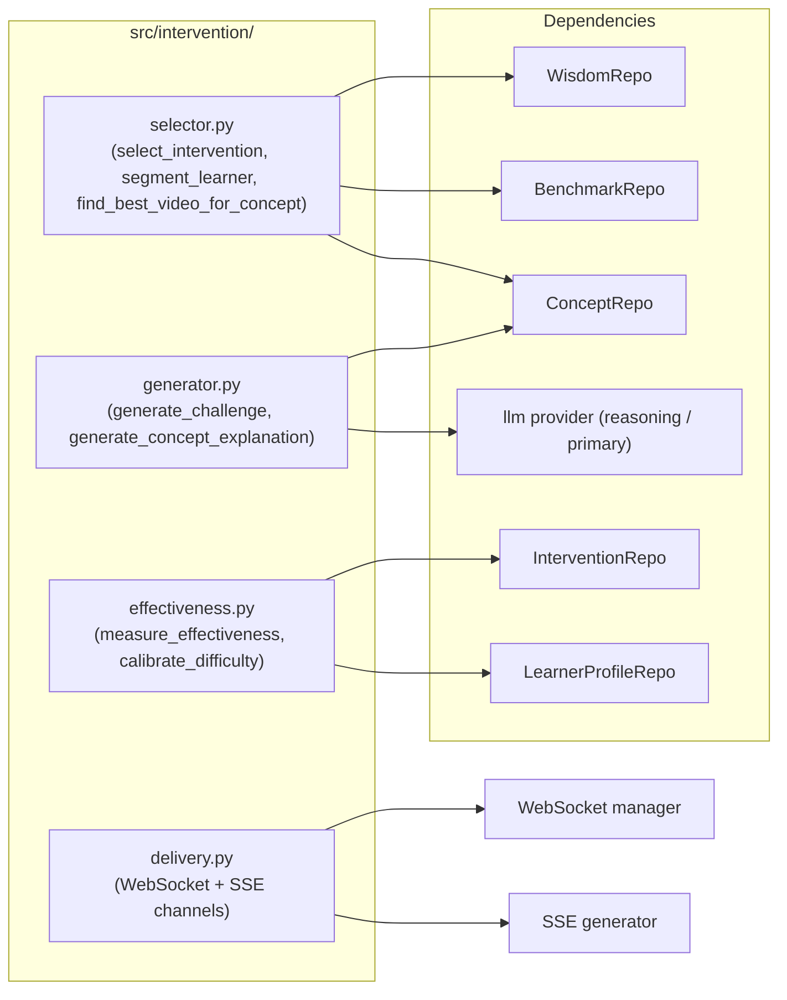

# Phase 7 — Intervention Engine: System Design Diagrams

The Intervention Engine is the **decision → content → delivery** pipeline that
turns the DECIDE node's chosen arm into a personalized message streamed to
the student's browser.

---

## 7.1 — High-Level Pipeline

---

## 7.2 — Selector Detail (Phase 7 §7.1)

The selector returns **candidate arms** ordered by expected effectiveness.
The DECIDE node then samples one with Thompson.

The four heuristics in detail:

| Step | Rule | Source |
|---|---|---|
| Type matching | visual/reading → video_recommendation; hands-on → hint + practice; reflective → code_review | profile.learning_style |
| Difficulty | engagement < 0.3 → encouragement; 0.3–0.6 → hint; 0.6–0.8 → practice; > 0.8 → code_review | profile + telemetry |
| Community boost | 1.5× weight on expected_effectiveness if GlobalWisdom reports high success | ai_wisdom_store |
| History dedup | exclude if same type+concept was used in the last 5 interventions | profile.intervention_log |

---

## 7.3 — Thompson Sampling Convergence

```mermaid
flowchart LR
    subgraph T1["Trial 1 — all arms have Beta(1,1)"]
        A1["hint: 0.72"]:::arm
        B1["practice: 0.31"]:::arm
        C1["video: 0.55"]:::arm
    end
    subgraph T5["Trial 5 — posteriors start to separate"]
        A5["hint Beta(3,2) → 0.68"]:::arm
        B5["practice Beta(2,2) → 0.45"]:::arm
        C5["video Beta(1,4) → 0.12"]:::arm
    end
    subgraph T10["Trial 10 — clear winner"]
        A10["hint Beta(6,4) → 0.61"]:::arm
        B10["practice Beta(4,2) → 0.73"]:::arm
        C10["video Beta(1,9) → 0.08"]:::arm
    end
    T1 --> T5 --> T10

    classDef arm fill:#dbeafe,stroke:#1d4ed8
```

Initially uniform priors. After 10 trials, the agent has **discovered** that
practice is the best arm for this concept — even though `hint` was the first
choice. Thompson sampling automatically transitions from explore to exploit.

---

## 7.4 — Generator Pipeline (LLM-driven)

The generator is **stateless** — every call re-formats the prompt from
current state. This makes it trivially cacheable and replayable.

---

## 7.5 — Challenge Generation Sub-flow (Generator Detail)

The challenge generator uses **two LLM calls**: one to produce, one to
critique, and a regeneration loop if quality is below 0.7.

---

## 7.6 — Delivery Channels

> WebSocket registration is per-user; a user may have **multiple browser
> tabs** open and each gets the message.

---

## 7.7 — Effectiveness Feedback Loop (Cross-Phase)

This loop closes Phase 6 ↔ Phase 7 ↔ Phase 5.

---

## 7.8 — Intervention Types

The 7 supported intervention types and what they map to.

| Type | Generator | Default channel | When used |
|---|---|---|---|
| `concept_explanation` | `generate_concept_explanation()` | websocket | mastery 0.3–0.6 + new concept |
| `video_recommendation` | `find_best_video_for_concept()` | websocket | visual learner + low engagement |
| `prerequisite_nudge` | LLM | websocket | unmastered prerequisite detected |
| `challenge_hint` | LLM | websocket | struggle on active challenge |
| `challenge_swap` | `generate_challenge()` | websocket | mastery > 0.6 (try harder) |
| `revision_prompt` | LLM | websocket | long gap since last activity |
| `encouragement` | LLM | websocket | engagement < 0.3 |

---

## 7.9 — Phase 7 Component Map

