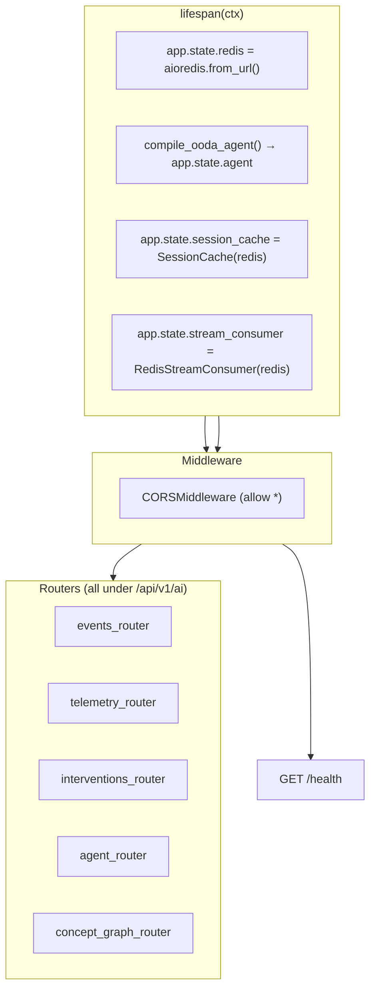
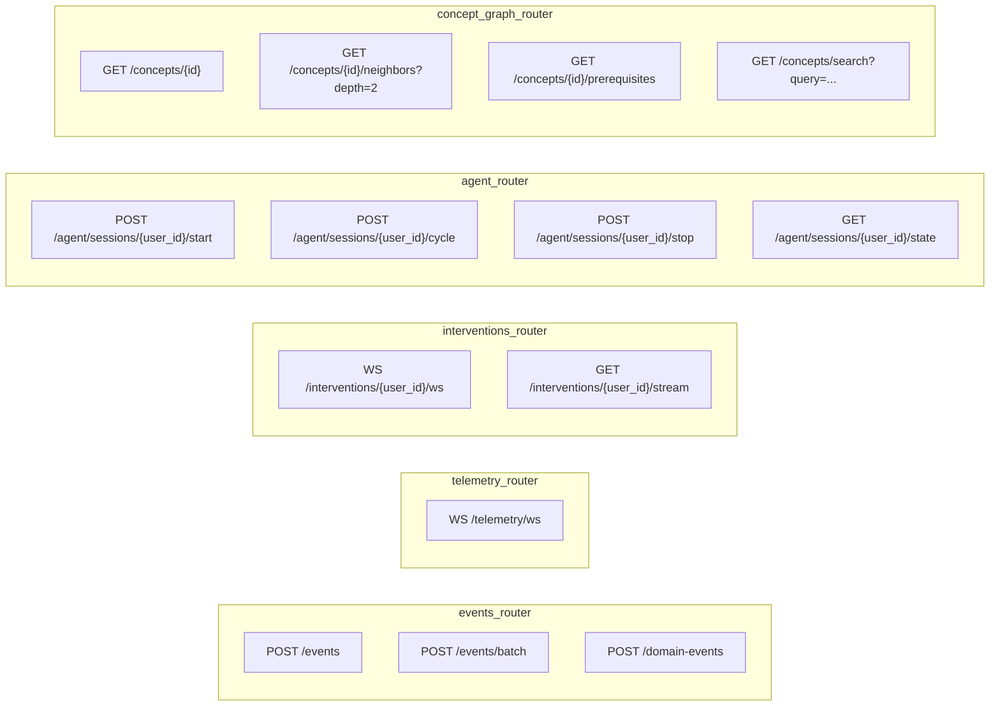
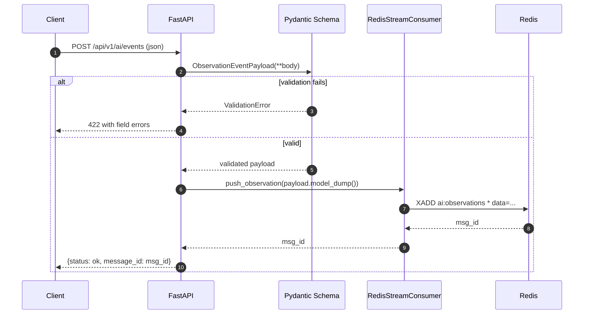
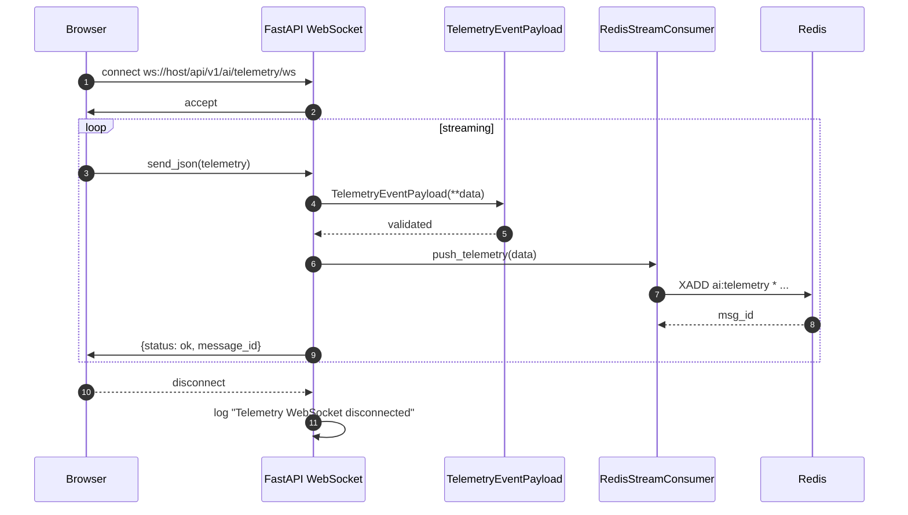
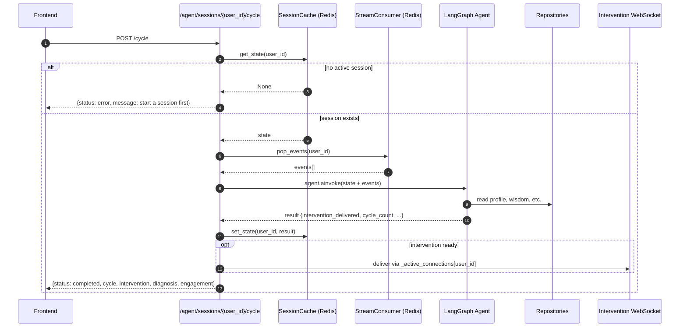
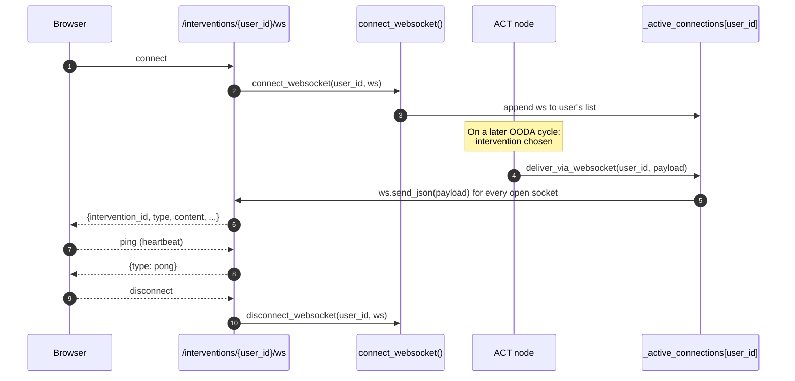
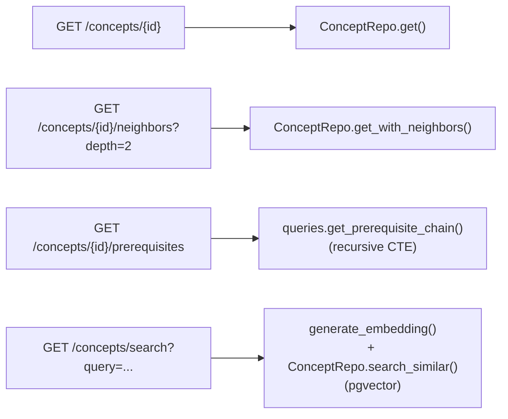
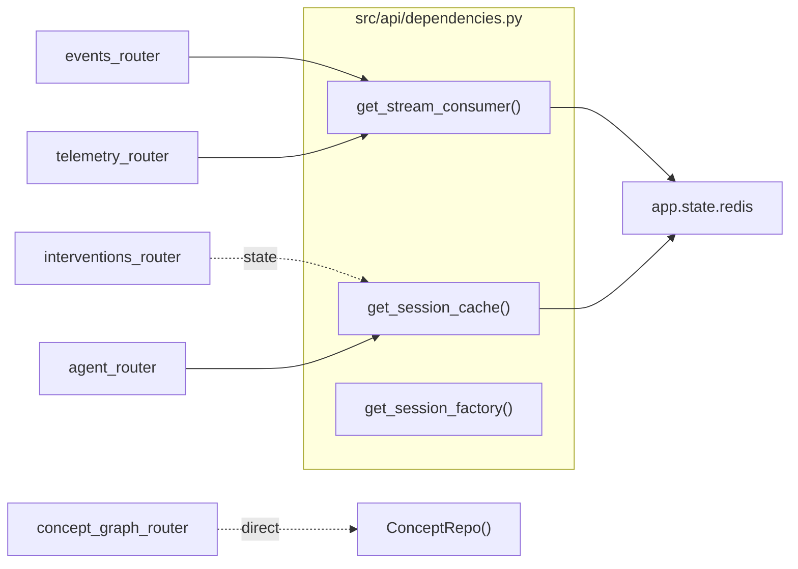
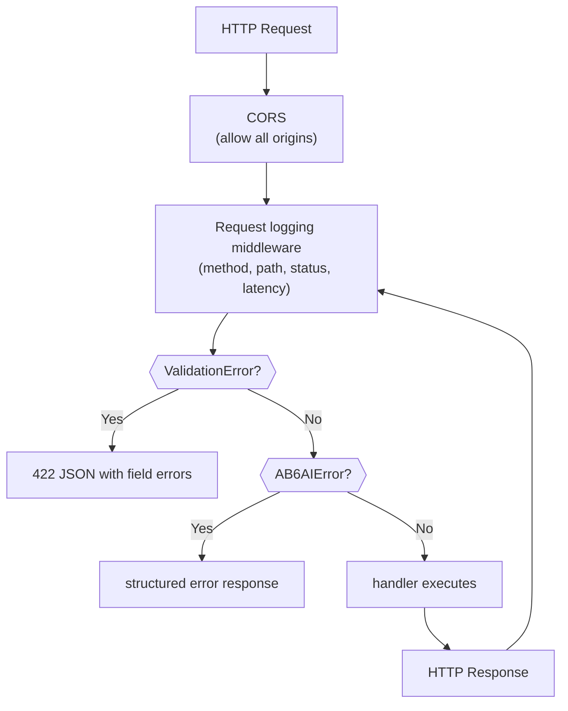
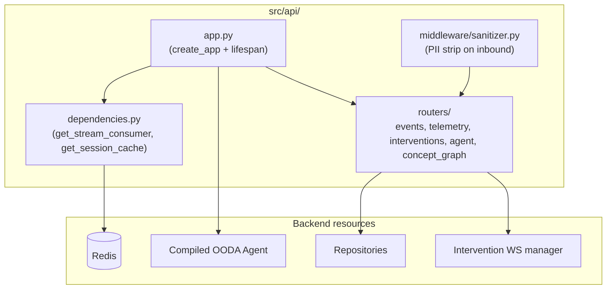

# Phase 8 — API Layer: System Design Diagrams

The API layer is the **only public surface** of the system. It maps HTTP,
WebSocket, and SSE requests to OODA cycles, event ingestion, telemetry
streaming, and intervention delivery.

---

## 8.1 — FastAPI Application Topology

---

## 8.2 — Router Map

All routers are mounted under the `/api/v1/ai` prefix in `app.py`.

---

## 8.3 — Event Ingestion Path

---

## 8.4 — Telemetry WebSocket Loop

---

## 8.5 — Agent Cycle Endpoint (The Core API)

This endpoint ties session cache + OODA graph + intervention delivery
together. It is the **primary API** used by the demos and (in production) by
the front-end.

---

## 8.6 — Intervention Delivery WebSocket

A user can have **multiple browser tabs** open — every active socket in
`_active_connections[user_id]` receives the message. Closed sockets are
pruned automatically.

---

## 8.7 — Concept Graph Endpoints

---

## 8.8 — Dependency Injection

DI keeps handlers thin and testable. Each handler receives its collaborators
via `Depends()`.

---

## 8.9 — Middleware & Exception Handlers

---

## 8.10 — Phase 8 Component Map

