# Phase 9 — Testing & Demo: System Design Diagrams

Phase 9 covers the **verification and presentation** layer: 21 unit tests that
guard the contracts established in Phases 1–8, and three demo scripts
(CLI, web, interactive) that exercise the full OODA loop end-to-end.

---

## 9.1 — Test Categories at a Glance

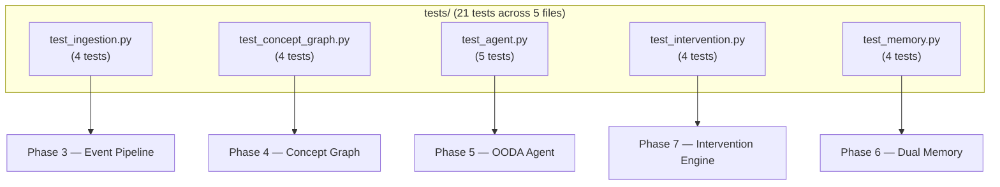

Each test file maps to **exactly one** of the implementation phases. The
correspondence is what makes regressions easy to localize.

---

## 9.2 — Test Fixture Map

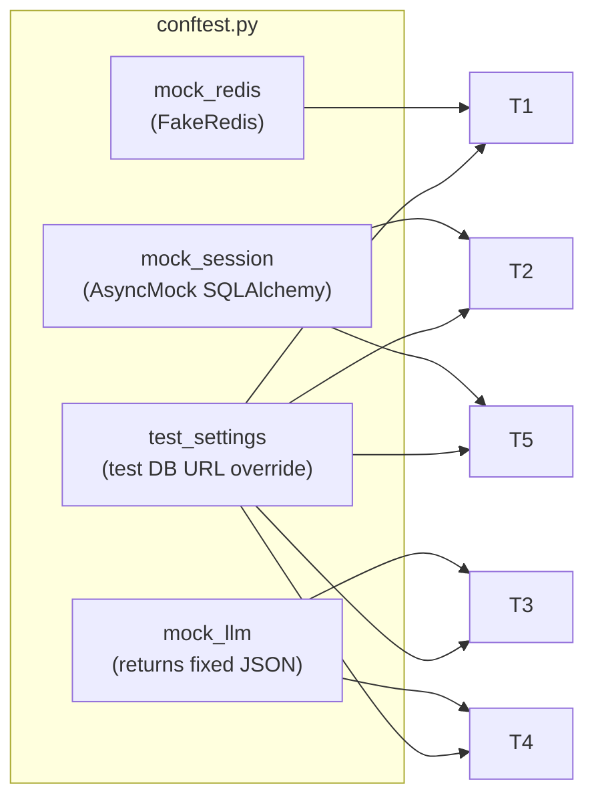

| Fixture | Phase covered | Replaces |
|---|---|---|
| `mock_redis` | Phase 3 | Real Redis (in-memory fake) |
| `mock_session` | Phases 1, 4, 6, 7 | Real PostgreSQL (AsyncMock) |
| `mock_llm` | Phases 2, 5, 7 | OpenAI / Anthropic / Google (returns canned JSON) |
| `test_settings` | All | Pydantic settings pointing at test DB |

---

## 9.3 — The 5 Test That Matter Most

### 9.3.1 — End-to-End OODA Cycle (regression guard)

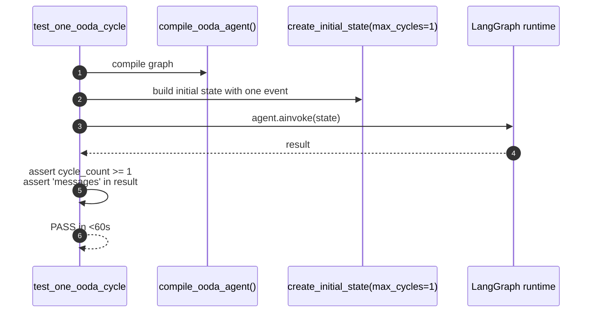

> This test **specifically guards** against the historic infinite-loop bug.
> It was the regression test added when the `continue_router` was wired in.

### 9.3.2 — Thompson Sampling Monte Carlo

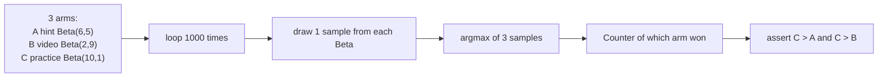

The arm with the **highest true success rate** (practice, 91%) is the
modal winner over 1000 trials — verifying the sampling distribution.

### 9.3.3 — Pydantic Validation at the Edge

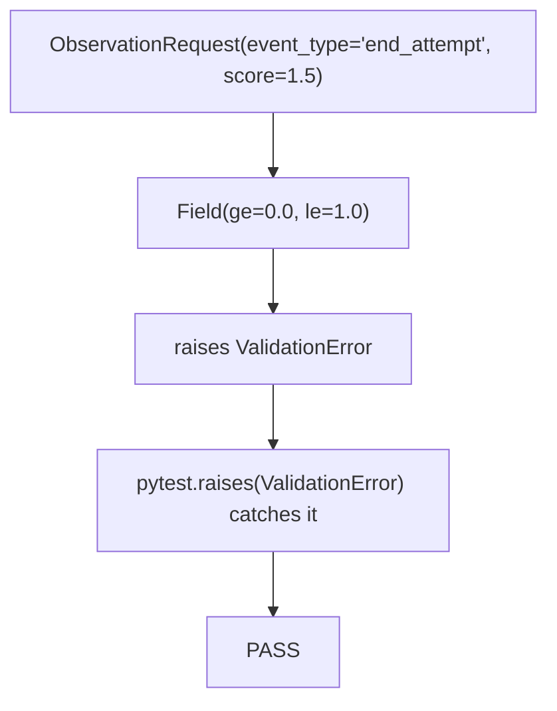

### 9.3.4 — Recursive CTE Walks Correctly

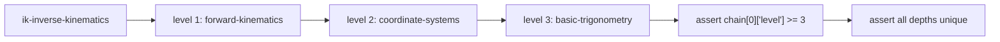

### 9.3.5 — Schema Defaults (Initial State)

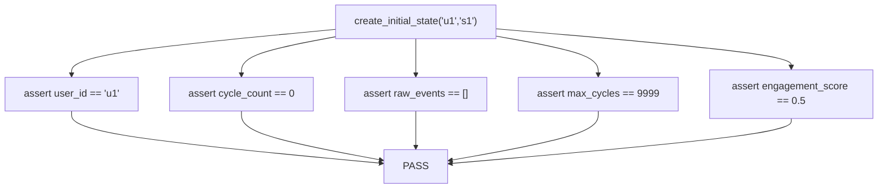

---

## 9.4 — Demo Scripts Side by Side

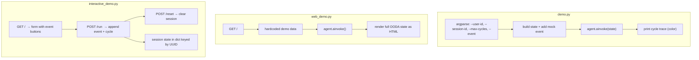

| Demo | Audience | Interaction | Persistence |
|---|---|---|---|
| `demo.py` | Developers | CLI args only | None — single cycle |
| `web_demo.py` | Quick visual check | None | None |
| `interactive_demo.py` | Live presentation | Form buttons | In-memory dict |

---

## 9.5 — Test Pyramid

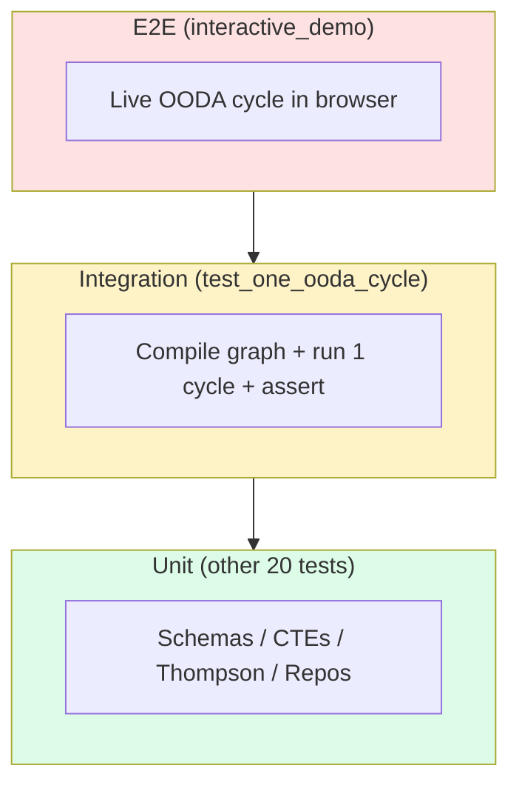

The 21 unit tests sit at the base; the integration test (`test_one_ooda_cycle`)
sits one level up; the interactive demo is the manual E2E at the top.

---

## 9.6 — Bugs Fixed (And Their Guarding Tests)

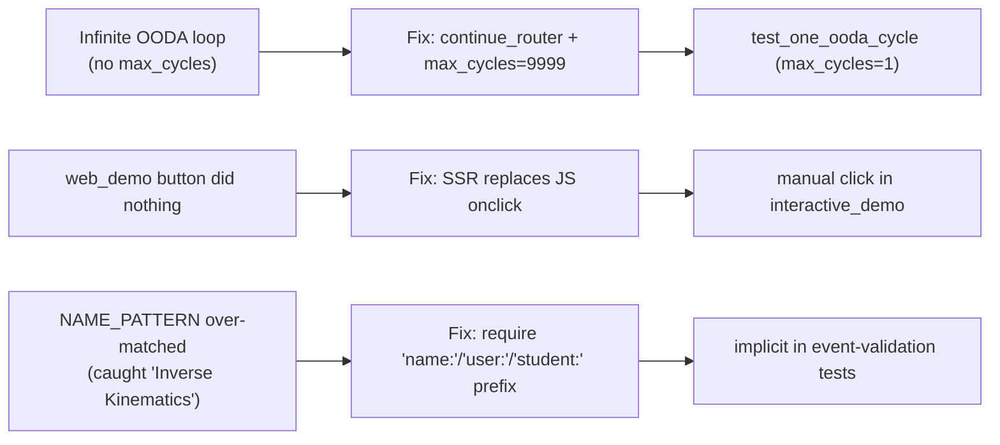

---

## 9.7 — How Tests Run

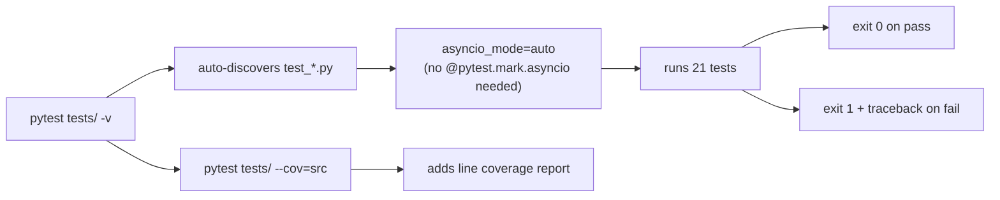

---

## 9.8 — CI View (Conceptual)

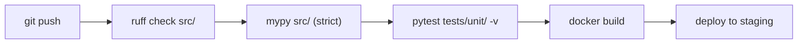

This is the suggested CI pipeline; only the test step is implemented in-repo
(`pyproject.toml` declares `asyncio_mode = "auto"`).

---

## 9.9 — Phase 9 Component Map

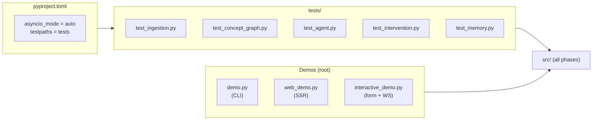
